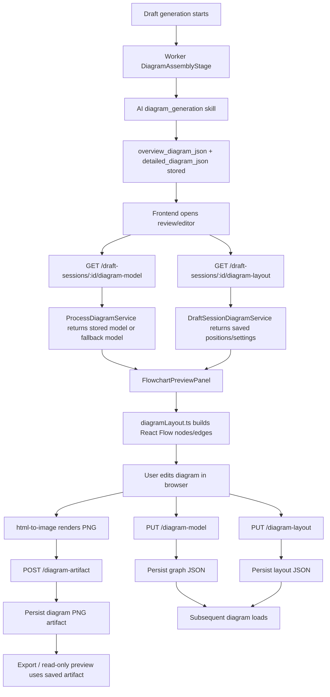

# 2026-04-17 Codebase Scan Conversation

This document records the repo scan and architectural summary from the 2026-04-17 discussion.

## User Request

> Please scan the codebase and let me know once you have full understaning of the code

## Scan Summary

I completed an architectural scan of the repo and reached a solid working understanding of how it is structured and how the main flows operate.

At a high level, this is a 3-part application:

- `frontend/`: React + Vite workspace UI with auth, workspace setup, session review/editing, diagram editing, billing, and admin views
- `backend/`: FastAPI API that owns auth, uploads, session state, review mutations, exports, admin metrics, quotas, billing, and portability wiring
- `worker/`: Celery-based background pipeline that performs transcript interpretation, workflow grouping, canonicalization, diagram assembly, and screenshot generation

The core flow is:

1. create a draft session and default meeting/process group
2. upload transcript, video, and template artifacts
3. queue background work with run guards
4. run worker pipeline stages for interpretation, grouping, diagram generation, and screenshots
5. review and edit the resulting session in the frontend
6. export DOCX or PDF from reviewed session data

## Important Correction To Older Docs

The older pilot-oriented docs do not fully describe the current repo. The codebase now includes:

- authenticated users and session cookies
- password and Google auth
- quotas and usage tracking
- admin console and operational metrics
- billing catalog, Stripe and Razorpay checkout, and GST invoice support
- AI-backed session-grounded Q&A
- multi-process grouping and diagram persistence

## Working Conclusion

The scan established a strong understanding of:

- architecture and composition roots
- main domain entities
- request and background-processing flows
- boundaries between frontend, backend, and worker responsibilities

It did not imply a line-by-line understanding of every file or every edge case in every service.

## Requested Follow-Up

The follow-up request was:

> Please do that.

That request asked for a concise codebase map and reading order.

## Codebase Map

### Runtime entry points

- Backend app bootstrapping: [backend/app/main.py](/abs/path/c:/Users/work/Documents/PddGenerator/backend/app/main.py:1)
- Backend dependency wiring: [backend/app/api/dependencies.py](/abs/path/c:/Users/work/Documents/PddGenerator/backend/app/api/dependencies.py:1)
- Frontend entry: [frontend/src/main.tsx](/abs/path/c:/Users/work/Documents/PddGenerator/frontend/src/main.tsx:1)
- Frontend routing: [frontend/src/router.tsx](/abs/path/c:/Users/work/Documents/PddGenerator/frontend/src/router.tsx:1)
- Worker Celery app: [worker/celery_app.py](/abs/path/c:/Users/work/Documents/PddGenerator/worker/celery_app.py:1)
- Worker pipeline composition root: [worker/pipeline/composition.py](/abs/path/c:/Users/work/Documents/PddGenerator/worker/pipeline/composition.py:1)

### Main product flow

- Session creation and artifact upload: [backend/app/api/routes/uploads.py](/abs/path/c:/Users/work/Documents/PddGenerator/backend/app/api/routes/uploads.py:1)
- Draft generation, screenshots, and review mutations: [backend/app/api/routes/draft_sessions.py](/abs/path/c:/Users/work/Documents/PddGenerator/backend/app/api/routes/draft_sessions.py:1)
- Export DOCX/PDF: [backend/app/api/routes/exports.py](/abs/path/c:/Users/work/Documents/PddGenerator/backend/app/api/routes/exports.py:1)
- Frontend workspace setup: [frontend/src/routes/WorkspaceRoute.tsx](/abs/path/c:/Users/work/Documents/PddGenerator/frontend/src/routes/WorkspaceRoute.tsx:1)
- Frontend session and review surface: [frontend/src/routes/SessionRoute.tsx](/abs/path/c:/Users/work/Documents/PddGenerator/frontend/src/routes/SessionRoute.tsx:1)
- Review page: [frontend/src/pages/StepReviewPage.tsx](/abs/path/c:/Users/work/Documents/PddGenerator/frontend/src/pages/StepReviewPage.tsx:1)
- Upload page: [frontend/src/pages/UploadPage.tsx](/abs/path/c:/Users/work/Documents/PddGenerator/frontend/src/pages/UploadPage.tsx:1)

### Backend structure

- `app/api/routes`: HTTP surface grouped by business area
- `app/services`: business logic and orchestration
- `app/models`: SQLAlchemy persistence layer
- `app/schemas`: API contracts exposed to frontend
- `app/core/config.py`: env-backed runtime settings and feature toggles
- `app/storage/storage_service.py`: storage abstraction
- `app/portability/*`: seams for auth, payments, job enqueueing, and related integrations

Most important backend services:

- [backend/app/services/pipeline_orchestrator.py](/abs/path/c:/Users/work/Documents/PddGenerator/backend/app/services/pipeline_orchestrator.py:1)
- [backend/app/services/job_dispatcher.py](/abs/path/c:/Users/work/Documents/PddGenerator/backend/app/services/job_dispatcher.py:1)
- [backend/app/services/draft_session_review_service.py](/abs/path/c:/Users/work/Documents/PddGenerator/backend/app/services/draft_session_review_service.py:1)
- [backend/app/services/draft_session_diagram_service.py](/abs/path/c:/Users/work/Documents/PddGenerator/backend/app/services/draft_session_diagram_service.py:1)
- [backend/app/services/document_renderer.py](/abs/path/c:/Users/work/Documents/PddGenerator/backend/app/services/document_renderer.py:1)

Core models:

- [backend/app/models/draft_session.py](/abs/path/c:/Users/work/Documents/PddGenerator/backend/app/models/draft_session.py:1)
- [backend/app/models/process_group.py](/abs/path/c:/Users/work/Documents/PddGenerator/backend/app/models/process_group.py:1)
- [backend/app/models/process_step.py](/abs/path/c:/Users/work/Documents/PddGenerator/backend/app/models/process_step.py:1)
- [backend/app/models/artifact.py](/abs/path/c:/Users/work/Documents/PddGenerator/backend/app/models/artifact.py:1)
- [backend/app/models/user.py](/abs/path/c:/Users/work/Documents/PddGenerator/backend/app/models/user.py:1)

### Worker structure

- Task entrypoints: [worker/tasks/draft_generation.py](/abs/path/c:/Users/work/Documents/PddGenerator/worker/tasks/draft_generation.py:1), [worker/tasks/screenshot_generation.py](/abs/path/c:/Users/work/Documents/PddGenerator/worker/tasks/screenshot_generation.py:1)
- Use-case layer: [worker/pipeline/use_cases.py](/abs/path/c:/Users/work/Documents/PddGenerator/worker/pipeline/use_cases.py:1)
- Stage definitions: `worker/pipeline/stages/*`
- AI skill registry: [worker/ai_skills/registry.py](/abs/path/c:/Users/work/Documents/PddGenerator/worker/ai_skills/registry.py:1)
- Transcript interpreter stack: `worker/ai_skills/transcript_interpreter/*`
- Workflow grouping and segmentation logic: `worker/grouping/*`
- Media utilities: `worker/media/*`
- Screenshot context and derivation: `worker/screenshot/*`

### Frontend structure

- Providers and app-wide state: [frontend/src/providers/AppProviders.tsx](/abs/path/c:/Users/work/Documents/PddGenerator/frontend/src/providers/AppProviders.tsx:1)
- Auth state: [frontend/src/providers/AuthProvider.tsx](/abs/path/c:/Users/work/Documents/PddGenerator/frontend/src/providers/AuthProvider.tsx:1)
- Route-level containers: `frontend/src/routes/*`
- Page components: `frontend/src/pages/*`
- API client and services: `frontend/src/services/*`
- Domain types: `frontend/src/types/*`
- Review, diagram, and session UI: `frontend/src/components/review/*`, `frontend/src/components/diagram/*`

Most important hooks:

- [frontend/src/hooks/useWorkspaceFlow.ts](/abs/path/c:/Users/work/Documents/PddGenerator/frontend/src/hooks/useWorkspaceFlow.ts:1)
- [frontend/src/hooks/useSessionActions.ts](/abs/path/c:/Users/work/Documents/PddGenerator/frontend/src/hooks/useSessionActions.ts:1)
- [frontend/src/hooks/useReviewWorkspace.ts](/abs/path/c:/Users/work/Documents/PddGenerator/frontend/src/hooks/useReviewWorkspace.ts:1)
- [frontend/src/hooks/useStepEditor.ts](/abs/path/c:/Users/work/Documents/PddGenerator/frontend/src/hooks/useStepEditor.ts:1)
- [frontend/src/hooks/useAskSession.ts](/abs/path/c:/Users/work/Documents/PddGenerator/frontend/src/hooks/useAskSession.ts:1)

### Platform features outside the core PDD flow

- Auth API: [backend/app/api/routes/auth.py](/abs/path/c:/Users/work/Documents/PddGenerator/backend/app/api/routes/auth.py:1)
- Billing API: [backend/app/api/routes/payments.py](/abs/path/c:/Users/work/Documents/PddGenerator/backend/app/api/routes/payments.py:1)
- Admin API: [backend/app/api/routes/admin.py](/abs/path/c:/Users/work/Documents/PddGenerator/backend/app/api/routes/admin.py:1)
- Billing page: [frontend/src/pages/BillingPage.tsx](/abs/path/c:/Users/work/Documents/PddGenerator/frontend/src/pages/BillingPage.tsx:1)
- Admin page: [frontend/src/pages/AdminPage.tsx](/abs/path/c:/Users/work/Documents/PddGenerator/frontend/src/pages/AdminPage.tsx:1)

## Recommended Reading Order

1. [docs/architecture.md](/abs/path/c:/Users/work/Documents/PddGenerator/docs/architecture.md)
2. [backend/app/main.py](/abs/path/c:/Users/work/Documents/PddGenerator/backend/app/main.py:1)
3. [backend/app/core/config.py](/abs/path/c:/Users/work/Documents/PddGenerator/backend/app/core/config.py:1)
4. [backend/app/api/dependencies.py](/abs/path/c:/Users/work/Documents/PddGenerator/backend/app/api/dependencies.py:1)
5. [backend/app/api/routes/uploads.py](/abs/path/c:/Users/work/Documents/PddGenerator/backend/app/api/routes/uploads.py:1)
6. [backend/app/api/routes/draft_sessions.py](/abs/path/c:/Users/work/Documents/PddGenerator/backend/app/api/routes/draft_sessions.py:1)
7. [backend/app/services/pipeline_orchestrator.py](/abs/path/c:/Users/work/Documents/PddGenerator/backend/app/services/pipeline_orchestrator.py:1)
8. [backend/app/services/job_dispatcher.py](/abs/path/c:/Users/work/Documents/PddGenerator/backend/app/services/job_dispatcher.py:1)
9. [worker/pipeline/composition.py](/abs/path/c:/Users/work/Documents/PddGenerator/worker/pipeline/composition.py:1)
10. [worker/tasks/draft_generation.py](/abs/path/c:/Users/work/Documents/PddGenerator/worker/tasks/draft_generation.py:1)
11. [frontend/src/router.tsx](/abs/path/c:/Users/work/Documents/PddGenerator/frontend/src/router.tsx:1)
12. [frontend/src/routes/WorkspaceRoute.tsx](/abs/path/c:/Users/work/Documents/PddGenerator/frontend/src/routes/WorkspaceRoute.tsx:1)
13. [frontend/src/routes/SessionRoute.tsx](/abs/path/c:/Users/work/Documents/PddGenerator/frontend/src/routes/SessionRoute.tsx:1)
14. [frontend/src/pages/StepReviewPage.tsx](/abs/path/c:/Users/work/Documents/PddGenerator/frontend/src/pages/StepReviewPage.tsx:1)

## Additional Follow-Up: Branch Setup Request

The later request was to create a branch for improving diagrams in the application.

The final state after that discussion was:

- uncommitted documentation changes were committed on `main`
- that commit was pushed to `origin/main`
- the working branch was created as `feature/diagram-improvements`

The commit created during that step was:

- `ffdf117` with message `Add codebase onboarding docs`

## Additional Follow-Up: Diagram System Scan

The next request was to scan the current code that generates and edits diagrams, explain both flows, provide a Mermaid diagram, identify the current diagram solution/library, and propose better alternatives and integrations.

### Diagram system summary

The current diagram stack is not a single renderer. It is a layered system:

1. worker-side initial diagram generation
2. backend-side diagram model serving and persistence
3. frontend-side layout, rendering, editing, and PNG export

The important detail is that there are three persisted diagram forms:

- logical graph JSON
- layout JSON
- a PNG artifact snapshot used for read-only preview/export reuse

That split works, but it creates possible drift between the editable model and the exported image snapshot.

### Current diagram creation flow

- During draft generation, the worker reaches `DiagramAssemblyStage`
- `DiagramAssemblyStage` invokes the AI `diagram_generation` skill
- That skill returns `overview` and `detailed` flowchart graph JSON
- The worker stores those as `overview_diagram_json` and `detailed_diagram_json`
- When the frontend requests a diagram, the backend returns stored diagram JSON first if present
- If stored JSON is absent or invalid, the backend falls back to deterministic flowchart construction in `ProcessDiagramService`
- The frontend then fetches saved node layout separately and applies a browser-side layout transform for React Flow

Relevant files:

- [worker/pipeline/stages/diagram_assembly.py](/abs/path/c:/Users/work/Documents/PddGenerator/worker/pipeline/stages/diagram_assembly.py:1)
- [worker/ai_skills/diagram_generation/skill.py](/abs/path/c:/Users/work/Documents/PddGenerator/worker/ai_skills/diagram_generation/skill.py:1)
- [backend/app/services/process_diagram_service.py](/abs/path/c:/Users/work/Documents/PddGenerator/backend/app/services/process_diagram_service.py:1)
- [backend/app/api/routes/draft_sessions.py](/abs/path/c:/Users/work/Documents/PddGenerator/backend/app/api/routes/draft_sessions.py:1)
- [frontend/src/services/diagramService.ts](/abs/path/c:/Users/work/Documents/PddGenerator/frontend/src/services/diagramService.ts:1)
- [frontend/src/components/diagram/diagramLayout.ts](/abs/path/c:/Users/work/Documents/PddGenerator/frontend/src/components/diagram/diagramLayout.ts:1)

### Current diagram edit flow

- The diagram editor lives in `FlowchartPreviewPanel`
- The frontend loads the graph via `GET /diagram-model`
- The frontend loads persisted positions and canvas settings via `GET /diagram-layout`
- The graph is rendered with React Flow
- The user can drag, resize, relabel, connect, delete, duplicate, and add nodes
- On save, the frontend sends three separate writes:
  - `PUT /diagram-model`
  - `PUT /diagram-layout`
  - `POST /diagram-artifact`
- The last call stores a PNG generated in the browser using `html-to-image`

Relevant files:

- [frontend/src/components/diagram/FlowchartPreviewPanel.tsx](/abs/path/c:/Users/work/Documents/PddGenerator/frontend/src/components/diagram/FlowchartPreviewPanel.tsx:1)
- [frontend/src/components/diagram/DiagramNodes.tsx](/abs/path/c:/Users/work/Documents/PddGenerator/frontend/src/components/diagram/DiagramNodes.tsx:1)
- [frontend/src/components/diagram/EditableEdge.tsx](/abs/path/c:/Users/work/Documents/PddGenerator/frontend/src/components/diagram/EditableEdge.tsx:1)
- [backend/app/services/draft_session_diagram_service.py](/abs/path/c:/Users/work/Documents/PddGenerator/backend/app/services/draft_session_diagram_service.py:1)
- [backend/app/services/artifact_ingestion.py](/abs/path/c:/Users/work/Documents/PddGenerator/backend/app/services/artifact_ingestion.py:1)
- [backend/app/models/diagram_layout.py](/abs/path/c:/Users/work/Documents/PddGenerator/backend/app/models/diagram_layout.py:1)

### Mermaid explanation diagram

### Current libraries and solutions in use

The application currently uses:

- `reactflow` for interactive flowchart rendering and editing
- `html-to-image` for browser-side PNG generation from the rendered diagram
- custom backend rendering logic in `ProcessDiagramService` for export-oriented image generation and fallback rendering
- Mermaid CLI support only for sequence-diagram export fallback via `mmdc`

It also has `elkjs` installed in the frontend package, but the current flowchart layout code is still primarily hand-written and not actively using ELK for automatic layout.

Relevant files:

- [frontend/package.json](/abs/path/c:/Users/work/Documents/PddGenerator/frontend/package.json:1)
- [frontend/src/components/diagram/FlowchartPreviewPanel.tsx](/abs/path/c:/Users/work/Documents/PddGenerator/frontend/src/components/diagram/FlowchartPreviewPanel.tsx:1)
- [backend/app/services/process_diagram_service.py](/abs/path/c:/Users/work/Documents/PddGenerator/backend/app/services/process_diagram_service.py:1)

### Interpretation of the current approach

Strengths:

- reasonable custom flowchart editor base using React Flow
- simple backend contract for graph and layout persistence
- manual BA editing is already supported

Weaknesses:

- layout is still mostly manual and brittle
- graph JSON, layout JSON, and PNG artifact can diverge
- the process model is generic flowchart JSON rather than a formal process standard
- new diagram capabilities require more custom editor logic in application code

## Better Options And Integration Possibilities

### 1. Recommended near-term option: keep React Flow and use ELKjs properly

This is the lowest-risk path for improving the current system.

Recommendation:

- keep React Flow as the rendering/editor layer
- replace most of the manual layout logic in `diagramLayout.ts` with ELK-based auto-layout

Why this is attractive:

- minimal rewrite
- better automatic layout
- preserves current editor patterns and persistence contracts

ELK references used in the discussion:

- ELK overview: https://eclipse.dev/elk/
- ELK getting started: https://eclipse.dev/elk/gettingstarted.html
- ELK layout options: https://eclipse.dev/elk/reference/options.html
- elkjs repository: https://github.com/kieler/elkjs

### 2. Best standards-based process modeling option: `bpmn-js`

If the long-term goal is true business process modeling rather than custom flowchart editing, `bpmn-js` is the strongest strategic option.

Why:

- it is a BPMN 2.0 viewer and web modeler
- it is designed for embedding in browser applications
- it has existing extension points for palette, rules, overlays, and properties

Tradeoff:

- larger migration
- requires deciding how much BPMN fidelity the application should expose to users

References used in the discussion:

- toolkit overview: https://bpmn.io/toolkit/bpmn-js
- walkthrough: https://bpmn.io/toolkit/bpmn-js/walkthrough/
- examples: https://bpmn.io/toolkit/bpmn-js/examples/

### 3. Richer custom editor option: JointJS+

If the goal is a more full-featured diagram editor than React Flow while staying in custom diagram territory, JointJS+ is a strong option.

Why:

- richer editor and diagramming capabilities
- React integration exists
- better built-in support for ports, tools, palettes, and export

Tradeoff:

- migration cost
- fuller experience is commercial

References used in the discussion:

- React integration: https://docs.jointjs.com/learn/integration/react/
- integration overview: https://docs.jointjs.com/learn/integration/
- product overview: https://www.jointjs.com/react-diagrams

### 4. Freeform canvas option: tldraw

This was explicitly considered but not recommended as the primary diagram editor for this repository.

Reason:

- tldraw is excellent for whiteboard-style editing
- this repository needs structured process/workflow diagramming more than freeform canvas work

References used in the discussion:

- installation: https://tldraw.dev/docs/installation
- basic React component example: https://tldraw.dev/examples/basic/basic

## Final Recommendation From The Discussion

The recommendation given in the conversation was:

1. short term: keep React Flow and introduce ELKjs-based layout
2. medium term: stop relying on PNG artifacts as the primary export truth and render export deterministically from model plus layout
3. strategic option: move toward BPMN with `bpmn-js` if standards-based process modeling becomes a real product goal
