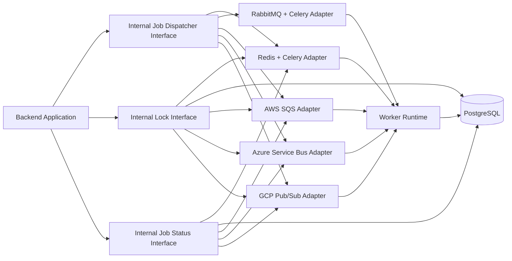

# Broker Decoupling Roadmap

## Purpose
This document explains:
- how enterprise applications typically think about broker coupling
- where the current application is coupled to Celery and Redis
- how to refactor the current design so the application can support different brokers across:
  - AWS
  - Azure
  - GCP
  - private customer-hosted environments

## 1. Enterprise View: Should Applications Be Tightly Coupled To A Broker?

### Short Answer
Good enterprise systems try to avoid tight coupling between:
- business logic
- queue / broker technology

But in real projects, many systems still couple directly to one broker because:
- delivery speed matters
- one broker is already standardized internally
- migration risk is considered low

### Better Enterprise Principle
Do not try to make the entire system infrastructure-agnostic at every line of code.

Instead:
- keep infrastructure-specific code at the edge
- keep business logic independent

That means:
- business services should not care whether the broker is:
  - Redis
  - RabbitMQ
  - SQS
  - Azure Service Bus
  - Pub/Sub
- only the adapter / transport layer should care

### Practical Enterprise Rule
Tight coupling is acceptable only when:
- deployment environment is fixed
- migration probability is low
- the platform standard is already chosen

In this application, that is not the right assumption because the product may be deployed across different customer environments.

## 2. Current Coupling In This Application

## Current Queue Stack
- `Celery` is the task execution framework
- `Redis` is currently used for:
  - broker
  - result backend
  - lock storage

### Primary Coupling Files
| File | Current Coupling |
|---|---|
| [worker/celery_app.py](C:\Users\work\Documents\PddGenerator\worker\celery_app.py) | Celery app configured directly with `redis_url` as broker and backend |
| [backend/app/services/job_dispatcher.py](C:\Users\work\Documents\PddGenerator\backend\app\services\job_dispatcher.py) | Direct Celery client creation, task enqueueing, Redis-backed lock logic |
| [worker/tasks/draft_generation.py](C:\Users\work\Documents\PddGenerator\worker\tasks\draft_generation.py) | Task registration tied to Celery |
| [worker/tasks/screenshot_generation.py](C:\Users\work\Documents\PddGenerator\worker\tasks\screenshot_generation.py) | Task registration tied to Celery |
| [backend/app/core/config.py](C:\Users\work\Documents\PddGenerator\backend\app\core\config.py) | Runtime settings shaped around `redis_url` |

### What Is Coupled Today
The current system is coupled in three areas:

#### 1. Dispatch coupling
- backend directly enqueues Celery tasks

#### 2. Broker coupling
- Celery broker assumes Redis

#### 3. Lock/result coupling
- screenshot lock is implemented using Redis-specific backend client behavior

## 3. What The Target Design Should Look Like

The target should be:

### Business layer
- knows only business jobs
- does not know broker implementation details

### Queue abstraction layer
- defines internal job-dispatch contracts
- defines lock contracts
- defines job-status contracts if needed

### Provider adapter layer
- Redis/Celery adapter
- RabbitMQ/Celery adapter
- AWS SQS adapter
- Azure Service Bus adapter
- GCP Pub/Sub adapter

### Worker execution layer
- consumes normalized internal job payloads
- does not depend on customer cloud choice

## 4. Target Architecture Shape



## 5. Design Goals

The refactor should aim for:
- same business workflow regardless of broker
- provider-specific code isolated to adapters
- minimal changes when moving from one broker to another
- support for customer-specific deployment standards
- clearer separation of:
  - dispatch
  - locking
  - status
  - execution

## 6. What “Portable” Should Mean Realistically

### Good Target
- same business logic
- same API behavior
- same worker job payload shape
- same application services
- only queue adapter and configuration change per environment

### Unrealistic Target
- “only change one connection string and everything works identically”

That is usually not realistic because brokers differ in:
- retry semantics
- ordering guarantees
- visibility timeout
- dead-letter behavior
- locking support
- result backend support
- consumer model

So the real goal is:
- **minimal provider-specific integration change**
- not “magic connection-string-only portability”

## 7. Recommended Internal Interfaces

### 1. Job Dispatcher Interface
Responsibilities:
- enqueue draft generation
- enqueue screenshot generation
- eventually enqueue future background job types

Example responsibilities:
- `enqueue_draft_generation(session_id)`
- `enqueue_screenshot_generation(session_id)`

### 2. Lock Manager Interface
Responsibilities:
- prevent duplicate screenshot generation
- prevent duplicate long-running jobs where required

Example responsibilities:
- `acquire_lock(key, ttl_seconds)`
- `release_lock(key)`

### 3. Job Status Interface
Responsibilities:
- expose queued / running / success / failure if required by UI or backend operations
- optionally decouple task-state tracking from Celery result backend

Example responsibilities:
- `record_job_queued(...)`
- `record_job_started(...)`
- `record_job_finished(...)`
- `record_job_failed(...)`

## 8. Recommended Roadmap

### Phase 1. Isolate Current Queue Usage
Goal:
- stop spreading direct Celery/Redis assumptions further

Changes:
- create internal interfaces:
  - `JobDispatcher`
  - `DistributedLockManager`
  - optional `JobStatusStore`
- keep current implementation backed by:
  - Celery
  - Redis

Output:
- no behavior change
- architecture boundary introduced

### Phase 2. Refactor Current Backend To Use Interfaces Only
Goal:
- remove direct Celery creation from application services

Changes:
- refactor [job_dispatcher.py](C:\Users\work\Documents\PddGenerator\backend\app\services\job_dispatcher.py)
- move Redis-specific lock code behind lock interface
- route API endpoints through abstractions only

Output:
- backend business code no longer depends on Redis/Celery directly

### Phase 3. Separate Broker, Lock, And Status Concerns
Goal:
- stop treating one system as broker + lock + result store for everything

Changes:
- define:
  - broker adapter
  - lock adapter
  - status adapter
- decide whether status should live in:
  - database
  - broker backend
  - dedicated task-state table

Recommended direction:
- keep durable job status in PostgreSQL where possible
- avoid relying too heavily on broker-specific result backends

Output:
- clearer portability across providers

### Phase 4. Standardize Job Payload Contract
Goal:
- make worker execution independent of transport vendor

Changes:
- define normalized internal job message shape
- include:
  - job type
  - session id
  - actor / request context if needed
  - timestamps / metadata if needed

Output:
- worker runtime consumes the same logical payload regardless of broker

### Phase 5. Implement First Alternate Adapter
Goal:
- prove abstraction is real

Recommended first alternative:
- `RabbitMQ + Celery`
or
- `AWS SQS`

Why:
- RabbitMQ is a strong self-hosted enterprise broker
- SQS is a common managed-cloud queue target

Output:
- first non-Redis implementation
- validates abstraction quality

### Phase 6. Add Cloud-Specific Adapters
Goal:
- support customer environments

Adapters:
- `RedisCeleryBrokerAdapter`
- `RabbitMqCeleryBrokerAdapter`
- `AwsSqsBrokerAdapter`
- `AzureServiceBusBrokerAdapter`
- `GcpPubSubBrokerAdapter`

Associated lock/status providers may differ per cloud.

Output:
- deployment flexibility across customer environments

### Phase 7. Move Worker Runtime Toward Transport-Neutral Consumption
Goal:
- reduce dependency on Celery as the only execution model

Two valid strategies:

#### Strategy A
Keep Celery where supported:
- Redis
- RabbitMQ
- SQS (with limitations)

#### Strategy B
Use custom worker runners / provider-native consumers for:
- Azure Service Bus
- GCP Pub/Sub
- future non-Celery brokers

Recommended long-term view:
- Celery should be one adapter path, not the architecture itself

## 9. Recommended First Refactor Scope

If starting now, the first implementation slice should be:

1. introduce interfaces
2. rename current implementation as `RedisCeleryJobDispatcher`
3. introduce `RedisLockManager`
4. move screenshot lock behavior out of dispatcher into lock interface
5. update backend dependency wiring to resolve through interface

This is the smallest useful decoupling step.

## 10. Suggested Target File Layout

Example future structure:

```text
backend/app/services/queue/
  interfaces.py
  job_dispatcher.py
  lock_manager.py
  status_store.py

backend/app/services/queue/providers/
  redis_celery_dispatcher.py
  rabbitmq_celery_dispatcher.py
  aws_sqs_dispatcher.py
  azure_servicebus_dispatcher.py
  gcp_pubsub_dispatcher.py

backend/app/services/locks/
  redis_lock_manager.py
  db_lock_manager.py
  dynamodb_lock_manager.py
```

## 11. Recommended Provider Strategy By Environment

### Private VPS / Self-hosted Customer
Preferred:
- RabbitMQ
or
- Redis

### AWS Customer
Preferred:
- SQS for queue
- DynamoDB or DB-backed lock/status if needed

### Azure Customer
Preferred:
- Azure Service Bus

### GCP Customer
Preferred:
- Pub/Sub

## 12. Final Recommendation

The right long-term move is:
- do not make Celery itself the core architecture abstraction
- do not make Redis the implicit source of truth for queue, status, and locking

Instead:
- define your own internal queue/lock/status interfaces
- keep provider-specific logic behind adapters
- allow Celery to remain one implementation, not the entire design

## 13. Meeting-Friendly Summary

If asked:

> Can this application be made broker-independent across AWS, Azure, GCP, and private infra?

Answer:

> Yes. The right way is to introduce an internal queue abstraction layer so business logic stays unchanged while only the broker adapter changes per customer environment. That is more realistic and maintainable than trying to rely on one broker-specific framework everywhere.

## 14. Exact Refactor Task List By File

This section maps the current repository to the minimum refactor work needed for broker decoupling.

### A. Files That Need Direct Refactor

| File | Current Responsibility | Refactor Needed |
|---|---|---|
| [backend/app/services/job_dispatcher.py](C:\Users\work\Documents\PddGenerator\backend\app\services\job_dispatcher.py) | Creates Celery client directly, enqueues tasks, uses Redis-backed lock logic | Split into interface-backed services. Remove direct Redis lock handling. Convert current implementation into `RedisCeleryJobDispatcher` plus `RedisLockManager`. |
| [worker/celery_app.py](C:\Users\work\Documents\PddGenerator\worker\celery_app.py) | Creates Celery app with Redis broker/backend | Move Celery-specific configuration behind provider-specific adapter/wiring. Keep as Redis/Celery implementation artifact, not global app assumption. |
| [backend/app/core/config.py](C:\Users\work\Documents\PddGenerator\backend\app\core\config.py) | Settings currently shaped around `redis_url` | Introduce explicit settings for broker type, broker URL, result backend, and lock backend. Stop assuming one `redis_url` is enough for all concerns. |
| [backend/app/api/dependencies.py](C:\Users\work\Documents\PddGenerator\backend\app\api\dependencies.py) | Dependency wiring for service resolution | Add provider resolution for queue abstraction interfaces. This is where environment-based implementation selection should happen. |
| [backend/app/api/routes/draft_sessions.py](C:\Users\work\Documents\PddGenerator\backend\app\api\routes\draft_sessions.py) | Uses dispatcher service for draft/screenshot enqueueing | Update route layer to depend only on abstract queue/lock interfaces, not Redis/Celery-specific behavior. |

### B. Files That Need Moderate Wiring Changes

| File | Current Responsibility | Refactor Needed |
|---|---|---|
| [worker/tasks/draft_generation.py](C:\Users\work\Documents\PddGenerator\worker\tasks\draft_generation.py) | Celery task wrapper for draft generation | Keep business logic same, but treat this as one transport adapter entrypoint rather than the only execution mechanism. |
| [worker/tasks/screenshot_generation.py](C:\Users\work\Documents\PddGenerator\worker\tasks\screenshot_generation.py) | Celery task wrapper for screenshot generation | Same as above. Preserve task behavior, isolate transport concern. |
| [backend/app/services/pipeline_orchestrator.py](C:\Users\work\Documents\PddGenerator\backend\app\services\pipeline_orchestrator.py) | Session orchestration and validation | Likely no deep logic change. Verify it does not accumulate queue-specific assumptions. |
| [docker-compose.yml](C:\Users\work\Documents\PddGenerator\docker-compose.yml) | Current Redis-based deployment topology | Eventually parameterize queue infra by environment. For Phase 1, just document Redis as current adapter implementation. |

### C. Files That Should Stay Mostly Unchanged

| File / Area | Why |
|---|---|
| Worker business pipelines under [worker/services](C:\Users\work\Documents\PddGenerator\worker\services) | These should remain transport-neutral. They are execution logic, not broker logic. |
| Draft/session schemas and models | Queue decoupling should not leak into core business schema unless explicit job-status persistence is added later. |
| Frontend request flows | Frontend should not need to know broker type. It should continue calling backend APIs the same way. |

### D. Recommended New Files

| Proposed File | Responsibility |
|---|---|
| `backend/app/services/queue/interfaces.py` | Shared queue abstraction interfaces |
| `backend/app/services/queue/providers/redis_celery_dispatcher.py` | Current Redis + Celery implementation |
| `backend/app/services/queue/providers/rabbitmq_celery_dispatcher.py` | Future RabbitMQ + Celery implementation |
| `backend/app/services/queue/providers/aws_sqs_dispatcher.py` | Future AWS SQS implementation |
| `backend/app/services/queue/providers/azure_servicebus_dispatcher.py` | Future Azure Service Bus implementation |
| `backend/app/services/queue/providers/gcp_pubsub_dispatcher.py` | Future GCP Pub/Sub implementation |
| `backend/app/services/queue/locks/redis_lock_manager.py` | Redis lock implementation |
| `backend/app/services/queue/locks/db_lock_manager.py` | Database-backed lock implementation |
| `backend/app/services/queue/status/db_job_status_store.py` | Optional database-backed job status store |

## 15. Proposed Interface Definitions

These are conceptual contracts, not code yet.

### A. Job Dispatcher Interface
Purpose:
- submit background jobs without exposing broker-specific details

Suggested responsibilities:
- `enqueue_draft_generation(session_id: str) -> str`
- `enqueue_screenshot_generation(session_id: str) -> str`
- future:
  - `enqueue_export_generation(session_id: str, export_kind: str) -> str`

Contract expectations:
- returns a transport/job identifier
- does not expose Celery-specific objects to calling code
- implementation may use Celery, SQS, Service Bus, or Pub/Sub internally

### B. Distributed Lock Manager Interface
Purpose:
- prevent duplicate background operations
- keep lock logic independent of queue/broker choice

Suggested responsibilities:
- `acquire_lock(key: str, ttl_seconds: int) -> bool`
- `release_lock(key: str) -> None`

Specialized convenience methods may still exist at service layer:
- `acquire_screenshot_generation_lock(session_id: str) -> bool`
- `release_screenshot_generation_lock(session_id: str) -> None`

Contract expectations:
- implementation can use Redis, database, DynamoDB, or another store
- calling code should not know which mechanism is used

### C. Job Status Store Interface
Purpose:
- persist job lifecycle information independently of a broker-specific result backend

Suggested responsibilities:
- `record_queued(job_id: str, job_type: str, session_id: str) -> None`
- `record_started(job_id: str) -> None`
- `record_succeeded(job_id: str, metadata: dict | None = None) -> None`
- `record_failed(job_id: str, error_detail: str) -> None`
- `get_status(job_id: str) -> JobStatus`

Contract expectations:
- may be backed by PostgreSQL
- may optionally mirror broker-native status
- should support operational visibility independent of Celery result backend

### D. Queue Provider Resolver Interface
Purpose:
- select correct queue/lock/status implementation based on environment

Suggested responsibilities:
- `get_job_dispatcher() -> JobDispatcher`
- `get_lock_manager() -> DistributedLockManager`
- `get_job_status_store() -> JobStatusStore`

Contract expectations:
- resolved through dependency injection
- configurable by environment variables / settings

## 16. Phase 1 Implementation Plan For This Repo

This plan is intentionally scoped to the smallest useful decoupling step without changing business behavior.

### Phase 1 Goal
Introduce abstraction boundaries while preserving:
- Redis as current broker
- Celery as current task execution framework
- current API behavior
- current worker behavior

### Phase 1 Success Criteria
- backend routes no longer depend on Redis/Celery details directly
- lock logic is separated from dispatch logic
- current Redis/Celery behavior still works unchanged
- queue provider can later be swapped by changing implementation binding, not business code

### Phase 1 Scope

#### 1. Introduce queue abstraction interfaces
Create conceptual modules for:
- `JobDispatcher`
- `DistributedLockManager`
- optional `JobStatusStore`

No behavior change yet.

#### 2. Rename current implementation conceptually
Current behavior should be treated as:
- `RedisCeleryJobDispatcher`
- `RedisLockManager`

This makes current implementation one provider, not the architecture itself.

#### 3. Move screenshot lock logic out of dispatcher
Current issue:
- dispatch and lock responsibilities are mixed in [job_dispatcher.py](C:\Users\work\Documents\PddGenerator\backend\app\services\job_dispatcher.py)

Target:
- dispatch interface only dispatches jobs
- lock manager handles duplicate-prevention locks

#### 4. Refactor backend dependency wiring
Update dependency resolution so route layer receives:
- abstract dispatcher
- abstract lock manager

not a concrete Redis/Celery service.

#### 5. Keep Celery task definitions unchanged
Do not refactor worker execution model in Phase 1.

Why:
- Phase 1 is about isolating coupling, not replacing runtime

#### 6. Introduce explicit broker settings
Current configuration should be expanded from:
- one `redis_url`

to clearer settings such as:
- `job_broker_type`
- `job_broker_url`
- `job_result_backend_type`
- `job_result_backend_url`
- `distributed_lock_backend_type`
- `distributed_lock_backend_url`

Phase 1 can still point all of them to Redis, but the shape must be future-ready.

### Phase 1 Out Of Scope
- replacing Celery
- adding SQS adapter
- adding Azure Service Bus adapter
- changing worker business logic
- redesigning frontend
- changing Action Log behavior

### Phase 1 Deliverables
- new queue abstraction interfaces
- current Redis/Celery implementation wrapped behind those interfaces
- lock management split from job dispatch
- backend dependency injection updated
- configuration model updated for future provider choice
- no functional regression in draft and screenshot generation

### Phase 1 Validation Checklist
- draft generation still queues correctly
- screenshot generation still queues correctly
- screenshot duplicate lock still works
- Action Logs still show queued and completed behavior
- worker still consumes tasks the same way
- no frontend API contract changes

## 17. Recommended Phase 1 Execution Order

1. Define interface contracts
2. Introduce Redis/Celery adapter classes
3. Split lock management from dispatch
4. Update dependency injection
5. Update route usage
6. Validate no behavioral change

## 18. What Phase 2 Should Do After That

After Phase 1 succeeds:
- implement first alternate adapter
  - RabbitMQ or SQS recommended
- introduce optional DB-backed job status tracking
- decide long-term whether Celery remains:
  - one provider implementation
  - or the permanent execution runtime
