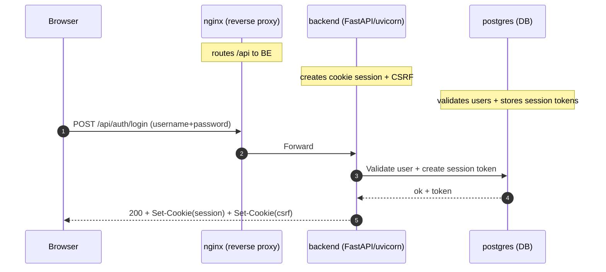
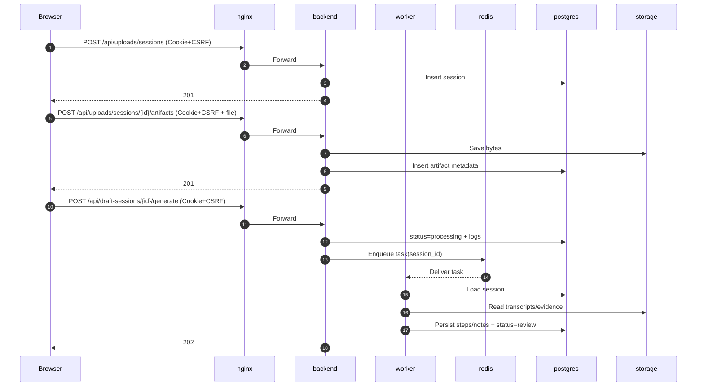
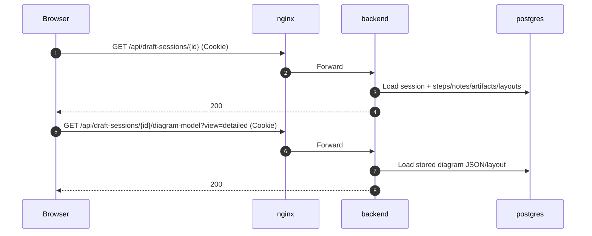
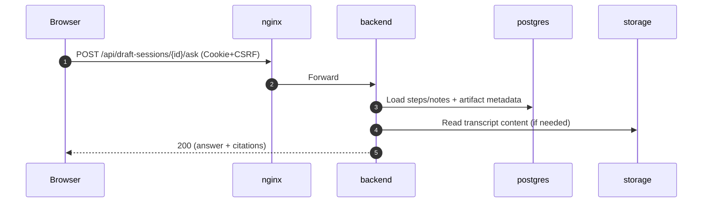
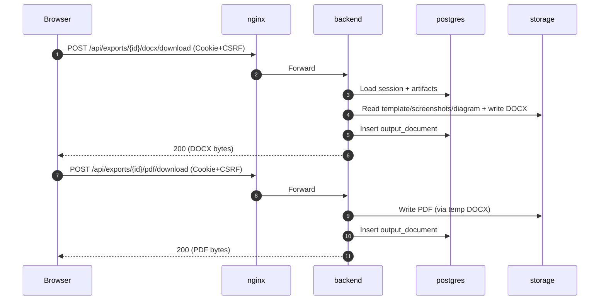

# Current Docker Compose Sequence Diagrams

These diagrams reflect the current implementation where each running container is treated as a service:
- `nginx` (reverse proxy / entrypoint)
- `frontend` (static UI files)
- `backend` (FastAPI + Uvicorn)
- `worker` (Celery background processing)
- `redis` (broker/cache)
- `postgres` (database)
- `storage` (local volume or object storage behind `backend`)

## Full Happy Path (Upload -> Generate -> Review -> Ask -> Edit -> Export)

```mermaid
sequenceDiagram
    autonumber
    participant U as Browser
    participant NG as nginx container (reverse proxy)
    participant FE as frontend container (static files)
    participant BE as backend container (FastAPI/uvicorn)
    participant WK as worker container (Celery)
    participant RD as redis container (broker/cache)
    participant PG as postgres container (DB)
    participant ST as storage (local volume / object store)

    Note over NG: Purpose: public entrypoint; serves FE; proxies /api to BE
    Note over FE: Purpose: serves built UI (HTML/JS/CSS)
    Note over BE: Purpose: auth + API (sessions, uploads, review, exports)
    Note over WK: Purpose: long-running generation pipeline (async)
    Note over RD: Purpose: message broker for WK (Celery)
    Note over PG: Purpose: source-of-truth relational data
    Note over ST: Purpose: bytes (uploads, screenshots, templates, exports)

    Note over U,FE: 1) Load UI
    U->>NG: GET /
    NG->>FE: Serve index.html + assets
    FE-->>NG: 200 (static)
    NG-->>U: 200

    Note over U,BE: 2) Login (cookie session + CSRF)
    U->>NG: POST /api/auth/login (username+password)
    NG->>BE: Forward /api/auth/login
    BE->>PG: Validate user + create session token
    PG-->>BE: ok + token
    BE-->>NG: 200 + Set-Cookie(session HttpOnly) + Set-Cookie(csrf)
    NG-->>U: 200 + cookies stored

    Note over U,BE: 3) Create session + upload artifacts
    U->>NG: POST /api/uploads/sessions (Cookie+CSRF)
    NG->>BE: Forward
    BE->>PG: Insert draft session row
    PG-->>BE: session_id
    BE-->>U: 201 Created (session)

    U->>NG: POST /api/uploads/sessions/{id}/artifacts (Cookie+CSRF + file)
    NG->>BE: Forward multipart upload
    BE->>ST: Save bytes (video/transcript/template/...)
    ST-->>BE: storage_path
    BE->>PG: Insert artifact metadata (storage_path)
    PG-->>BE: committed
    BE-->>U: 201 Created (artifact)

    Note over U,WK: 4) Generate draft (async)
    U->>NG: POST /api/draft-sessions/{id}/generate (Cookie+CSRF)
    NG->>BE: Forward
    BE->>PG: status=processing + action log "queued"
    BE->>RD: Enqueue Celery task(session_id)
    RD-->>WK: Deliver task
    BE-->>U: 202 Accepted (X-Task-Id)

    Note over WK: Worker pipeline (simplified)
    WK->>PG: Load session + artifact metadata
    WK->>ST: Read transcript bytes / evidence
    ST-->>WK: bytes
    WK->>PG: Persist steps/notes/screenshots + status=review + logs
    PG-->>WK: committed

    Note over U,BE: 5) Review (fetch session + diagram)
    U->>NG: GET /api/draft-sessions/{id} (Cookie)
    NG->>BE: Forward
    BE->>PG: Load session + steps/notes/artifacts/layouts
    PG-->>BE: session payload
    BE-->>U: 200

    U->>NG: GET /api/draft-sessions/{id}/diagram-model?view=detailed (Cookie)
    NG->>BE: Forward
    BE->>PG: Load stored diagram JSON/layout if any
    BE-->>U: 200 (diagram model)

    Note over U,BE: 6) Ask this session (grounded Q&A)
    U->>NG: POST /api/draft-sessions/{id}/ask (Cookie+CSRF)
    NG->>BE: Forward
    BE->>PG: Load steps/notes + artifact metadata
    BE->>ST: Read transcript chunks (if needed)
    ST-->>BE: text/bytes
    BE-->>U: 200 (answer + citations)

    Note over U,BE: 7) Modify process + diagram (edits)
    U->>NG: PATCH /api/draft-sessions/{id}/steps/{stepId} (Cookie+CSRF)
    NG->>BE: Forward
    BE->>PG: Update process_step + action log
    PG-->>BE: committed
    BE-->>U: 200

    U->>NG: PUT /api/draft-sessions/{id}/diagram-layout?view=detailed (Cookie+CSRF)
    NG->>BE: Forward
    BE->>PG: Upsert diagram_layout
    BE-->>U: 200

    U->>NG: PUT /api/draft-sessions/{id}/diagram-model?view=detailed (Cookie+CSRF)
    NG->>BE: Forward
    BE->>PG: Persist edited diagram JSON + log
    BE-->>U: 200

    U->>NG: POST /api/draft-sessions/{id}/diagram-artifact (Cookie+CSRF)
    NG->>BE: Forward (PNG data URL)
    BE->>ST: Save diagram PNG (export reuse)
    BE->>PG: Upsert diagram artifact metadata
    BE-->>U: 200

    Note over U,BE: 8) Export Word/PDF (download)
    U->>NG: POST /api/exports/{id}/docx/download (Cookie+CSRF)
    NG->>BE: Forward
    BE->>PG: Load session + steps/notes + artifacts
    BE->>ST: Read template/screenshots/diagram + write export
    BE->>PG: Insert output_document + status=exported
    BE-->>U: 200 (DOCX bytes)

    U->>NG: POST /api/exports/{id}/pdf/download (Cookie+CSRF)
    NG->>BE: Forward
    BE->>ST: Write PDF export (via temp DOCX)
    BE->>PG: Insert output_document
    BE-->>U: 200 (PDF bytes)
```

## Login (Container View)



## Upload + Generate Draft (Container View)



## Review (View Process + Diagram) (Container View)



## Ask This Session (Container View)



## Export (Word/PDF) (Container View)


