# Enterprise Architecture And Security Review

## Purpose
This document is a presentation-ready architecture and deployment overview for Security, Infra, and Enterprise Platform teams evaluating deployment of the application inside the organization.

It reflects the current repository structure and runtime behavior, and also includes the recommended hardened target-state for enterprise deployment.

## 1. Current Runtime Architecture
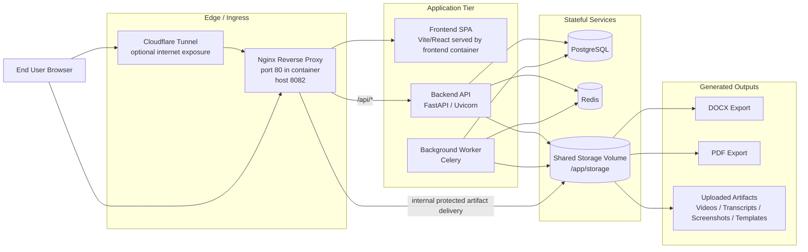

## 2. Processing And Review Flow
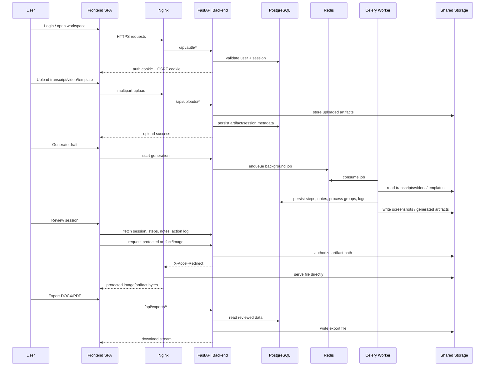

## 3. Trust Boundaries
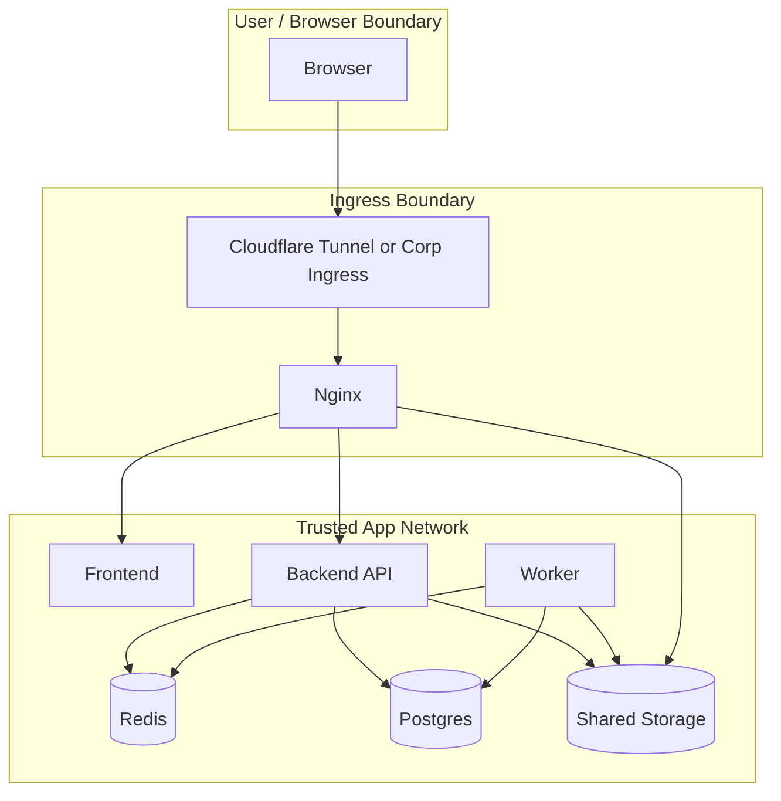

## 4. What Exists Today
- Frontend SPA served behind `nginx`
- Backend implemented in `FastAPI`
- Background processing implemented with `Celery + Redis`
- Primary database is `PostgreSQL`
- Artifacts and exports are stored on shared storage
- Protected artifact delivery uses backend authorization plus `nginx` internal redirect
- Authentication is session-cookie based, not bearer-token based
- CSRF middleware and CSRF cookie are present
- CORS is configured in backend
- Database schema is validated on startup
- Storage abstraction supports:
  - local filesystem today
  - S3 / R2-compatible object storage in future

## 5. Security Controls Already Present
- Session cookie authentication in [auth.py](C:\Users\work\Documents\PddGenerator\backend\app\api\routes\auth.py)
- CSRF protection in backend middleware
- Reverse-proxy API segregation in [default.conf](C:\Users\work\Documents\PddGenerator\deploy\nginx\default.conf)
- Protected artifact serving through `X-Accel-Redirect`
- Ownership check before artifact retrieval in [uploads.py](C:\Users\work\Documents\PddGenerator\backend\app\api\routes\uploads.py)
- Background jobs separated from the request path through Redis/Celery
- Storage backend abstraction in [storage_service.py](C:\Users\work\Documents\PddGenerator\backend\app\storage\storage_service.py)

## 6. Current Container Topology
- `frontend`
  - serves the React SPA
- `nginx`
  - public reverse proxy
  - routes `/api/*` to backend
  - routes SPA/static requests to frontend
  - serves protected local artifacts internally
- `backend`
  - FastAPI application
  - auth, upload, review, export, admin APIs
- `worker`
  - Celery background processing
  - transcript interpretation, workflow processing, screenshot generation
- `postgres`
  - primary relational datastore
- `redis`
  - broker/backend for asynchronous jobs
- `tunnel`
  - optional Cloudflare Tunnel for internet exposure

## 7. Authentication And Session Security
- Authentication is username/password based in the current implementation
- Successful login creates a server-side authenticated session token
- Session token is stored in an `HttpOnly` cookie
- CSRF token is issued separately in a cookie
- Backend uses CSRF middleware for request protection
- Recommended enterprise change:
  - replace local auth with SSO / OIDC / SAML

## 8. Data Storage And File Handling
- Uploaded artifacts:
  - videos
  - transcripts
  - templates
  - screenshots
  - generated exports
- Current storage mode:
  - local shared volume mounted at `/app/storage`
- Backend storage abstraction already supports:
  - local storage
  - S3-compatible object storage
  - Cloudflare R2-style object storage
- Protected image/artifact delivery:
  - backend validates ownership
  - backend returns `X-Accel-Redirect`
  - nginx serves bytes directly from internal protected path

## 9. Export Flow
- User requests DOCX or PDF export
- Backend loads reviewed session data from PostgreSQL
- Backend generates the output document
- Output file is written to storage
- Backend streams the file back to the client for download
- Action Log records export events

## 10. Questions Security And Infra Teams Are Likely To Ask
- Where are secrets stored
  - currently environment-variable driven
  - recommended: enterprise secrets manager / vault
- How is public ingress handled
  - currently Cloudflare tunnel can front nginx
  - recommended: corporate ingress / WAF / reverse proxy
- Are Redis and Postgres public
  - should be private-only in enterprise deployment
- Is storage encrypted
  - depends on host disk or object-storage configuration
- Is malware scanning applied to uploads
  - not currently shown in the app flow
- Is RBAC implemented
  - current model is user ownership, not enterprise RBAC
- Are audit logs available
  - application action logs exist
  - security audit trail should be extended
- Is there a retention and backup policy
  - infra policy required for production deployment
- What outbound connections exist
  - AI provider calls may exist if external model APIs are enabled

## 11. Recommended Enterprise Deployment Target
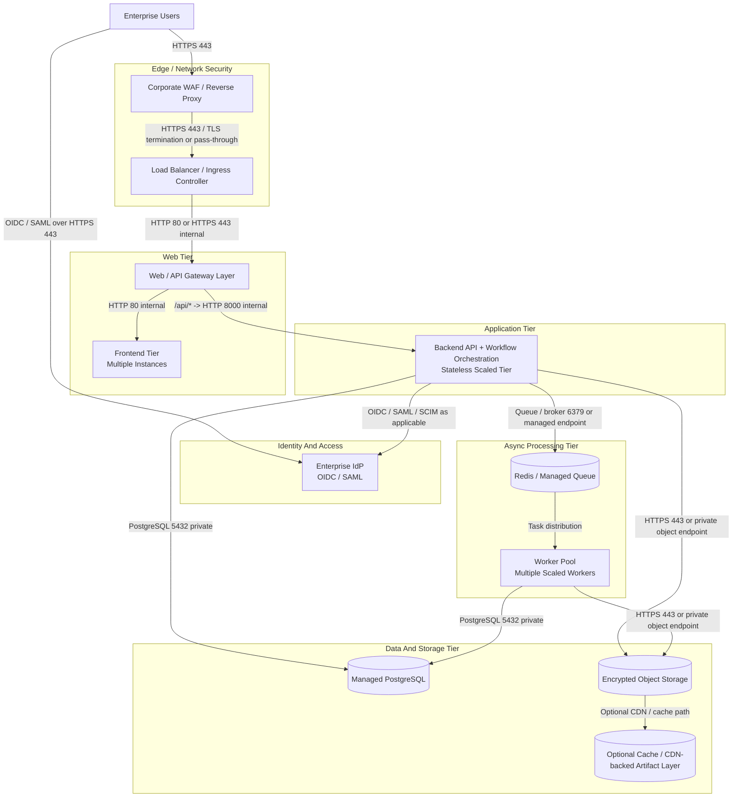

### Recommended Enterprise Tiering
- `Edge / Network Security`
  - corporate WAF
  - ingress controller or load balancer
  - TLS termination and request filtering
- `Web Tier`
  - multiple frontend instances for availability
  - API gateway / nginx tier separated from app logic
- `Application Tier`
  - horizontally scalable backend API instances
  - orchestration layer remains stateless and replaceable
- `Async Processing Tier`
  - shared queue / broker
  - multiple worker instances for transcript processing, screenshot generation, and export-related background jobs
  - worker pool can be scaled independently of frontend/backend traffic
- `Data And Storage Tier`
  - managed PostgreSQL
  - encrypted object storage for artifacts and exports
  - optional cache / CDN-backed artifact acceleration layer
- `Security Services`
  - enterprise secrets manager
  - malware / DLP scanning
  - centralized key management
- `Observability And Operations`
  - centralized logs
  - metrics, tracing, and alerting
  - backup and disaster recovery controls

### Worker Scaling Recommendation
- Use multiple worker instances instead of a single shared worker
- Split queues where needed, for example:
  - `draft-generation`
  - `screenshot-generation`
  - future `export-generation`
- Scale workers independently based on workload type
  - CPU-heavy transcript processing
  - IO-heavy storage and export activity
  - FFmpeg/screenshot extraction jobs
- Recommended enterprise control points:
  - concurrency limits per queue
  - autoscaling based on queue depth
  - worker health probes
  - per-worker service accounts / least privilege access

## 12. Recommended Hardening Before Organizational Rollout
- Replace local shared storage with encrypted object storage
- Move secrets from `.env` files into enterprise secret management
- Keep PostgreSQL and Redis on private network segments only
- Replace local login with enterprise SSO / OIDC / SAML
- Add RBAC and administrative policy controls
- Add antivirus / DLP scanning on uploads
- Add security audit logs for:
  - authentication
  - upload
  - export
  - artifact access
  - administrative actions
- Add backup, restore, and retention policy
- Run containers as non-root where possible
- Add image and dependency vulnerability scanning
- Restrict outbound network access for AI provider calls if external LLM APIs are used
- Add document/data classification review for uploaded legal and business content

## 13. One-Slide Executive Summary
- UI:
  - React SPA behind nginx
- API:
  - FastAPI backend
- Async processing:
  - Celery worker via Redis
- Database:
  - PostgreSQL
- Storage:
  - shared filesystem today, object-storage-ready by design
- Auth:
  - session cookie + CSRF
- Protected file access:
  - backend authorization + nginx internal redirect
- Deployment:
  - Docker Compose today
  - enterprise ingress, SSO, secrets manager, and object storage recommended for production

## 14. Source Files
- [docker-compose.yml](C:\Users\work\Documents\PddGenerator\docker-compose.yml)
- [default.conf](C:\Users\work\Documents\PddGenerator\deploy\nginx\default.conf)
- [main.py](C:\Users\work\Documents\PddGenerator\backend\app\main.py)
- [auth.py](C:\Users\work\Documents\PddGenerator\backend\app\api\routes\auth.py)
- [uploads.py](C:\Users\work\Documents\PddGenerator\backend\app\api\routes\uploads.py)
- [exports.py](C:\Users\work\Documents\PddGenerator\backend\app\api\routes\exports.py)
- [storage_service.py](C:\Users\work\Documents\PddGenerator\backend\app\storage\storage_service.py)
- [celery_app.py](C:\Users\work\Documents\PddGenerator\worker\celery_app.py)

## 15. Project Dependency Inventory

### Runtime Language Baseline
| Component | Runtime | Version |
|---|---|---|
| `backend` | Python | `>=3.11` |
| `worker` | Python | `>=3.11` |
| `frontend` | Node.js / npm toolchain | required for build and local development |
| `host OS` | Ubuntu | `25.10` |

### Frontend Runtime Dependencies
Source:
- [package.json](C:\Users\work\Documents\PddGenerator\frontend\package.json)

| Package | Version | Purpose |
|---|---|---|
| `react` | `^19.2.0` | Frontend UI runtime |
| `react-dom` | `^19.2.0` | Browser DOM rendering |
| `react-router-dom` | `^7.13.1` | Client-side routing |
| `@tanstack/react-query` | `^5.90.21` | API data fetching, caching, mutation state |
| `reactflow` | `^11.11.4` | Diagram and flow rendering |
| `elkjs` | `^0.9.3` | Graph layout engine |
| `html-to-image` | `^1.11.13` | Client-side image capture/export support |

### Frontend Dev Dependencies
Source:
- [package.json](C:\Users\work\Documents\PddGenerator\frontend\package.json)

| Package | Version | Purpose |
|---|---|---|
| `typescript` | `^5.6.3` | Type checking |
| `vite` | `^6.4.1` | Frontend dev server and build tool |
| `@vitejs/plugin-react` | `^4.4.1` | React integration for Vite |
| `vitest` | `^4.1.0` | Frontend test runner |
| `jsdom` | `^29.0.0` | Browser-like test environment |
| `@testing-library/react` | `^16.3.2` | React UI testing |
| `@testing-library/jest-dom` | `^6.9.1` | DOM matchers for tests |
| `@types/react` | `^19.2.0` | React TypeScript typings |
| `@types/react-dom` | `^19.2.0` | React DOM TypeScript typings |

### Backend Runtime Dependencies
Source:
- [pyproject.toml](C:\Users\work\Documents\PddGenerator\backend\pyproject.toml)

| Package | Version | Purpose |
|---|---|---|
| `fastapi` | `0.115.12` | Backend API framework |
| `uvicorn` | `0.34.3` | ASGI application server |
| `sqlalchemy` | `2.0.41` | ORM and database access |
| `psycopg[binary]` | `3.2.10` | PostgreSQL driver |
| `alembic` | `1.16.1` | Database migrations |
| `pydantic-settings` | `2.10.1` | Settings and configuration management |
| `python-multipart` | `0.0.20` | Multipart form and file uploads |
| `httpx` | `0.28.1` | HTTP client for AI/API integrations |
| `celery[redis]` | `5.5.3` | Background task integration and Redis queue support |
| `boto3` | `1.38.46` | Object storage integration for S3/R2-compatible backends |
| `docxtpl` | `0.20.1` | DOCX template rendering |
| `docx2pdf` | `0.1.8` | DOCX to PDF conversion support |
| `pillow` | `11.2.1` | Image handling |

### Worker Runtime Dependencies
Source:
- [pyproject.toml](C:\Users\work\Documents\PddGenerator\worker\pyproject.toml)

| Package | Version | Purpose |
|---|---|---|
| `celery[redis]` | `5.5.3` | Background worker framework and Redis queue support |
| `sqlalchemy` | `2.0.41` | Database access from worker jobs |
| `psycopg[binary]` | `3.2.10` | PostgreSQL driver |
| `pydantic-settings` | `2.10.1` | Worker configuration loading |
| `httpx` | `0.28.1` | AI/API HTTP calls |
| `boto3` | `1.38.46` | Object storage access for artifacts and exports |

### Dependency Notes For Security And Infra Review
- Backend and worker both depend on:
  - `httpx`
  - `sqlalchemy`
  - `psycopg`
  - `pydantic-settings`
  - `boto3`
- Background processing depends on:
  - `celery[redis]`
  - `redis` as broker/backend service
- Document generation depends on:
  - `docxtpl`
  - `docx2pdf`
- Frontend build and runtime are independent of backend Python dependencies
- Storage abstraction supports either:
  - local filesystem
  - S3 / R2-compatible object storage

## 16. System-Level And OS Dependencies

### Target Linux Baseline
- Planned deployment OS:
  - `Ubuntu 25.10`
- This matters for:
  - package availability
  - `ffmpeg` installation and patching
  - `LibreOffice` / `soffice` availability
  - Python runtime packaging behavior
  - container host hardening standards

### Video Processing Dependencies
Source:
- [video_frame_extractor.py](C:\Users\work\Documents\PddGenerator\worker\services\video_frame_extractor.py)
- [Dockerfile](C:\Users\work\Documents\PddGenerator\worker\Dockerfile)

| Dependency | Where Used | Why It Is Needed |
|---|---|---|
| `ffmpeg` | Worker container / worker host runtime | Extracts screenshots / frame candidates from uploaded videos |
| `ffprobe` | Worker container / worker host runtime | Reads video duration and metadata for timestamp-based screenshot extraction |

### Document Export And PDF Conversion Dependencies
Source:
- [document_renderer.py](C:\Users\work\Documents\PddGenerator\backend\app\services\document_renderer.py)
- [document_pdf_converter.py](C:\Users\work\Documents\PddGenerator\backend\app\services\document_pdf_converter.py)
- [Dockerfile](C:\Users\work\Documents\PddGenerator\backend\Dockerfile)

| Dependency | Where Used | Why It Is Needed |
|---|---|---|
| `docxtpl` | Backend Python runtime | Renders DOCX templates using structured context data |
| `docx2pdf` | Backend Python runtime | Attempts DOCX-to-PDF conversion |
| `LibreOffice` / `soffice` | Backend container / Linux runtime | Linux-compatible DOCX-to-PDF conversion fallback |

### Important Linux Runtime Notes
- On Linux, `docx2pdf` alone is not sufficient for reliable PDF export
- The backend implementation explicitly falls back to `LibreOffice` via `soffice --headless`
- Therefore, for Linux deployment, PDF export support should be treated as requiring:
  - `LibreOffice`
  - `soffice` available in `PATH`
- For the planned host baseline, validate these packages specifically on:
  - `Ubuntu 25.10`
- On Windows, `docx2pdf` may use Microsoft Word automation where available
- In the current Dockerized Linux deployment, backend image already installs `libreoffice`
- In the current worker image, worker image already installs `ffmpeg`

### Infra Review Notes For System Dependencies
- These are not just library dependencies; they are host/container runtime prerequisites
- Security and Infra teams should validate:
  - source and patching policy for `ffmpeg`
  - source and patching policy for `LibreOffice`
  - container image scanning for both
  - CPU and memory sizing for:
    - screenshot extraction
    - PDF conversion
  - timeout controls for `ffmpeg` and conversion subprocesses
  - sandboxing / process-execution policy for spawned subprocesses

## 17. Server Configuration And Port Mapping

### Server Baseline
- OS:
  - `Ubuntu 25.10`
- Runtime:
  - Docker
  - Docker Compose
- Reverse proxy:
  - `nginx`
- App API:
  - `FastAPI + Uvicorn`
- Background jobs:
  - `Celery`
- Queue / result backend:
  - `Redis`
- Database:
  - `PostgreSQL`
- Public exposure:
  - enterprise ingress / reverse proxy recommended
  - current repo also supports `cloudflared`

### Current Deployment Diagram With Ports
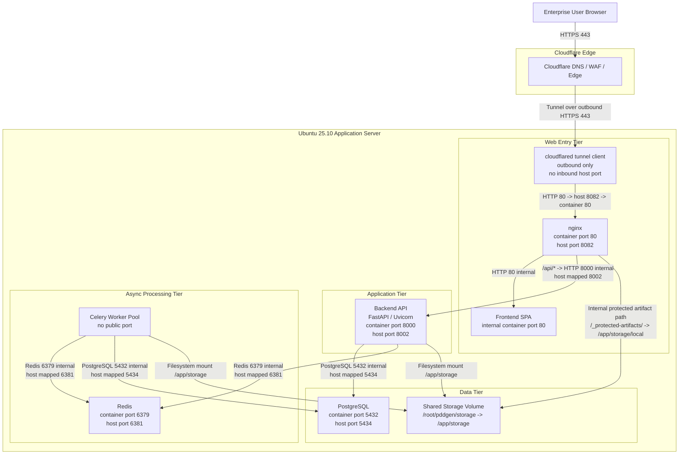

### Current Service Ports
| Service | Container Port | Host Port | Purpose | Exposure |
|---|---:|---:|---|---|
| `nginx` | `80` | `8082` | reverse proxy for frontend and `/api` | user-facing |
| `frontend` | `80` | none | serves SPA behind nginx | internal only |
| `backend` | `8000` | `8002` | FastAPI API | should be internal in enterprise |
| `worker` | none | none | Celery background jobs | internal only |
| `redis` | `6379` | `6381` | queue / result backend | internal only |
| `postgres` | `5432` | `5434` | relational database | internal only |
| `tunnel` | none | none | outbound tunnel client | optional |

### Recommended Enterprise Port Policy
| Service | Recommended Exposure |
|---|---|
| `nginx` | only ingress-exposed service |
| `frontend` | no direct exposure |
| `backend` | private network only |
| `worker` | private network only |
| `redis` | private network only |
| `postgres` | private network only |
| `tunnel` | remove if the organization uses its own ingress |

### Current Host-Level Configuration
- Shared storage mount:
  - host: `/root/pddgen/storage`
  - containers: `/app/storage`
- nginx routing and protected artifact delivery:
  - [default.conf](C:\Users\work\Documents\PddGenerator\deploy\nginx\default.conf)
- container topology and port mapping:
  - [docker-compose.yml](C:\Users\work\Documents\PddGenerator\docker-compose.yml)

### Recommended Enterprise Network Layout
```text
Internet / Enterprise Users
    ->
Corporate WAF / Reverse Proxy / Load Balancer
    ->
nginx (only exposed application service)
    ->
frontend + backend
    ->
redis / postgres / worker / storage on private network
```

### Important Infrastructure Notes
- `backend:8002`, `redis:6381`, and `postgres:5434` are currently mapped on the host for convenience
- For enterprise deployment, host port publishing should be removed for:
  - backend
  - redis
  - postgres
- In the current tunnel-based internet exposure model, the public flow is:
  - browser
  - Cloudflare edge / WAF
  - cloudflared tunnel client on VPS
  - nginx
  - frontend or backend
- Only ingress should be allowed to reach nginx
- Worker capacity should scale horizontally without any port exposure
- Protected artifacts are not intended to be public static files:
  - backend authorizes access
  - nginx serves the internal file path

## 18. Local Vs VPS Runtime Behavior

### Local Development Behavior
Current local development is typically split between Dockerized stateful services and host-run stateless services.

#### Local containers commonly running
- `postgres`
- `redis`

#### Local host processes commonly running outside Docker
- `backend`
  - started with `uvicorn`
- `frontend`
  - started with `npm run dev`
- `worker`
  - started with `celery`

### Local Runtime Model
```text
Docker containers:
- postgres
- redis

Host processes:
- backend
- frontend
- worker
```

### VPS / Server Runtime Behavior
On the VPS, the intended deployment model is fully containerized.

#### VPS containers
- `postgres`
- `redis`
- `backend`
- `worker`
- `frontend`
- `nginx`
- `tunnel`

### VPS Runtime Model
```text
Docker containers:
- postgres
- redis
- backend
- worker
- frontend
- nginx
- tunnel
```

### Why Local And VPS Differ
- Local development favors:
  - faster code reload
  - easier debugging
  - simpler frontend/backend iteration
- VPS deployment favors:
  - reproducible environment
  - consistent service startup
  - containerized runtime isolation

## 19. Role Of Nginx And Tunnel

### Tunnel Role
The tunnel is the public ingress bridge.

Its job is to:
- receive requests from the public internet
- securely forward them into the server environment
- avoid exposing application services directly in a simple VPS setup

In the current stack, `cloudflared` performs this role.

### Nginx Role
Nginx is the internal traffic controller and reverse-proxy layer.

Its job is to:
- route frontend traffic to the frontend service
- route `/api/*` requests to the backend
- support SPA route fallback such as `/auth` or `/workspace`
- serve protected artifacts after backend authorization
- act as the primary web gateway inside the deployment

### Example Request Flow For One User Request
If a user opens:
- `https://your-domain/auth`

The request path is:
1. Browser sends request to the public domain
2. Tunnel receives the public request
3. Tunnel forwards it to nginx
4. Nginx recognizes this as a frontend route
5. Nginx forwards the request to the frontend service
6. Frontend returns the SPA shell and assets

If the frontend then calls:
- `/api/auth/me`

The request path is:
1. Browser sends API request
2. Tunnel forwards to nginx
3. Nginx sees `/api/*`
4. Nginx proxies request to backend
5. Backend checks auth/session and returns JSON response

If the frontend requests a protected image or artifact:
1. Browser requests artifact
2. Nginx sends auth request through backend route
3. Backend validates ownership
4. Backend returns internal redirect header
5. Nginx serves the actual file from protected storage

### Simple Analogy
- Tunnel:
  - road from the outside world into the server
- Nginx:
  - reception desk deciding which internal service handles the request

## 20. Enterprise Production View Of Nginx And Tunnel

### Nginx In Enterprise Production
An nginx-like layer is still needed in enterprise production, even if nginx itself is replaced.

The enterprise platform still needs a service that can:
- reverse proxy requests
- route frontend and API traffic
- terminate TLS or receive already-terminated traffic
- handle protected file delivery
- perform ingress control and request forwarding

Possible enterprise equivalents:
- nginx
- ingress controller
- API gateway
- Envoy
- HAProxy
- enterprise reverse proxy / load balancer

### Tunnel In Enterprise Production
A public tunnel is usually not needed in enterprise production if the organization already has:
- corporate DNS
- enterprise WAF
- reverse proxy
- ingress controller
- load balancer
- firewall-managed ingress

In that model, the usual flow is:
```text
Enterprise Users
-> Corporate WAF / Reverse Proxy / Load Balancer
-> nginx or ingress layer
-> frontend / backend services
```

### Enterprise Recommendation
- keep the reverse-proxy / ingress layer
- remove the tunnel if enterprise ingress infrastructure already exists
- keep worker, Redis, PostgreSQL, and storage on private network segments

## 21. Production-Grade Sizing Recommendation For 20K Concurrent Users

### Important Assumptions
The phrase `20K parallel users` needs clarification in a formal capacity review. The sizing below assumes:
- up to `20,000` concurrent signed-in users
- the majority are:
  - browsing
  - reviewing sessions
  - loading artifacts
  - exporting occasionally
- only a smaller active subset is simultaneously triggering heavy jobs such as:
  - draft generation
  - screenshot extraction
  - document export
- PostgreSQL, Redis, object storage, and ingress are deployed in enterprise-grade highly available mode
- horizontal scaling is allowed for stateless tiers

If the requirement instead means:
- `20,000` users all triggering AI workflow generation at the same time

then the required worker capacity is materially higher and must be validated with full-scale performance testing.

### Recommended Production Topology
- `2` availability zones minimum
- `1` enterprise WAF / reverse proxy layer
- `1` load balancer / ingress layer
- `2` frontend instances minimum
- `4` backend API instances minimum
- `6` worker instances minimum
- `1` highly available PostgreSQL primary
- `1` PostgreSQL standby / replica
- `1` highly available Redis deployment
- encrypted object storage for artifacts and exports

### Recommended Server / Instance Sizing
The following is a strong initial production baseline, not a final benchmark-certified number.

| Tier | Count | Recommended Class | vCPU | RAM | Notes |
|---|---:|---|---:|---:|---|
| Web / frontend tier | 2 | general purpose | 4 | 8 GB | serves SPA and terminates app-facing web routing behind enterprise ingress |
| Backend API tier | 4 | general purpose | 8 | 32 GB | FastAPI, auth, uploads, review APIs, export initiation |
| Worker tier | 6 | compute-heavy | 16 | 64 GB | AI workflow processing, screenshot extraction, export-related heavy jobs |
| PostgreSQL primary | 1 | memory optimized | 16 | 64 GB | production relational store |
| PostgreSQL standby | 1 | memory optimized | 16 | 64 GB | failover / read scaling / recovery |
| Redis | 1 HA deployment | memory optimized | 8 | 32 GB | queue / broker / result backend |

### Example AWS-Oriented Mapping
This is an example mapping only, using current AWS families as reference points:
- Web / frontend tier:
  - `m7i.2xlarge`
  - `8 vCPU / 32 GiB`
- Backend API tier:
  - `m7i.2xlarge` or `m7i.4xlarge`
  - `8-16 vCPU / 32-64 GiB`
- Worker tier:
  - `c7i.4xlarge` or `c7i.8xlarge`
  - `16-32 vCPU / 32-64 GiB`
- PostgreSQL tier:
  - `r7i.4xlarge` or `r7i.8xlarge`
  - `16-32 vCPU / 128-256 GiB`
- Redis tier:
  - `r7i.2xlarge` or managed equivalent
  - `8 vCPU / 64 GiB` class depending on queue depth and retention

Official references used for instance-family orientation:
- AWS M7i general-purpose instances: https://aws.amazon.com/ec2/instance-types/m7i/
- AWS C7i compute-optimized instances: https://aws.amazon.com/ec2/instance-types/c7i/
- AWS memory-optimized instances including R7i: https://aws.amazon.com/ec2/instance-types/memory-optimized/

### Recommended Role Breakdown
#### 1. Enterprise ingress layer
- WAF / reverse proxy / load balancer
- should be provided by enterprise platform or cloud ingress services

#### 2. Web tier
- serves frontend assets
- routes requests to backend
- should be horizontally scalable

#### 3. Backend API tier
- stateless
- scale by CPU, request concurrency, and authenticated session load
- minimum `4` instances recommended for 20K concurrent users

#### 4. Worker tier
- heaviest compute tier
- handles:
  - transcript interpretation
  - workflow intelligence
  - screenshot extraction through `ffmpeg`
  - export-related processing
- scale independently from web/backend
- minimum `6` workers recommended as an initial production baseline

#### 5. Data tier
- PostgreSQL should be HA and backed up
- Redis should be HA or managed
- object storage should be encrypted and lifecycle-managed

### Why Worker Tier Is Heaviest
- screenshot extraction invokes `ffmpeg`
- PDF conversion may invoke `LibreOffice`
- workflow intelligence and AI integration are CPU- and IO-intensive
- worker scaling is the main lever for heavy-job throughput

### Recommended Scaling Strategy
- scale `frontend` and `backend` based on:
  - request concurrency
  - CPU
  - response latency
- scale `worker` based on:
  - queue depth
  - job duration
  - screenshot workload
  - export workload
- scale `PostgreSQL` based on:
  - connection count
  - transaction latency
  - storage IOPS
- scale `Redis` based on:
  - queue depth
  - broker latency
  - persistence settings if enabled

### Production Caveat
This sizing is a serious starting point, but not the final authority. Before organizational rollout, the team should run:
- load testing
- queue-depth testing
- screenshot-generation throughput testing
- export concurrency testing
- failover testing

For formal sign-off, production sizing should be validated against:
- expected daily active users
- true peak concurrent users
- average uploads per hour
- AI request latency
- average transcript size
- average video duration

## 22. Container Connectivity View

### Current VPS Container Connectivity
This view shows the current container-to-container network shape on the VPS.

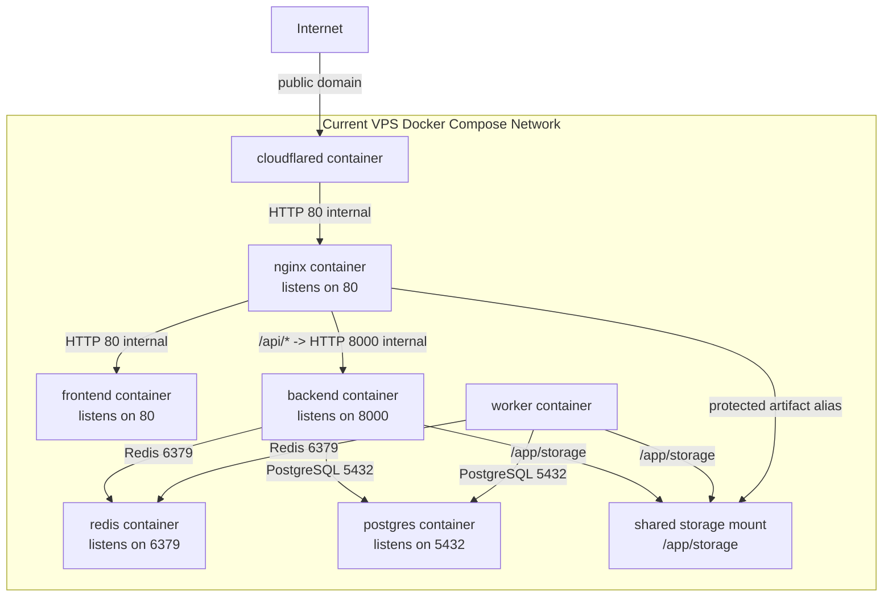

### Current VPS Host Port Exposure
| Container | Internal Port | Host Port | Used For |
|---|---:|---:|---|
| `nginx` | `80` | `8082` | web entry |
| `backend` | `8000` | `8002` | backend API host mapping |
| `postgres` | `5432` | `5434` | database host mapping |
| `redis` | `6379` | `6381` | broker/cache host mapping |
| `frontend` | `80` | none | only reachable via nginx |
| `worker` | none | none | background-only |
| `tunnel` | none | none | outbound tunnel client |

### Enterprise Production Container / Pod Connectivity
This view shows the recommended enterprise runtime in container terms.

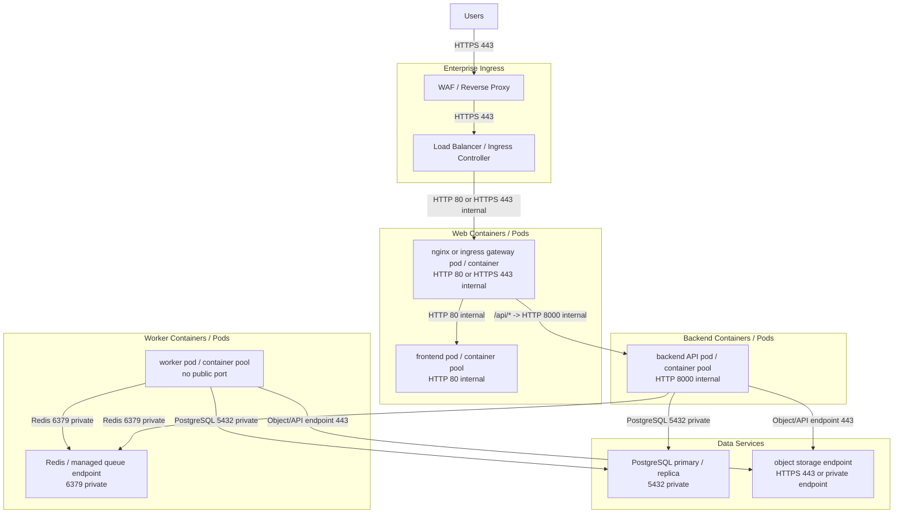

### Enterprise Container Port Policy
| Tier | Internal Port | Public Exposure |
|---|---:|---|
| frontend pool | `80` | none |
| nginx / gateway | `80` / `443` | only through enterprise ingress |
| backend API pool | `8000` | none |
| worker pool | none | none |
| Redis | `6379` | none |
| PostgreSQL | `5432` | none |
| object storage | `443` or private service endpoint | private / managed |

### Summary
- Current VPS:
  - tunnel container receives public traffic
  - nginx routes to frontend and backend
  - backend and worker both connect to Redis, PostgreSQL, and shared storage
- Enterprise production:
  - remove tunnel
  - keep an ingress / gateway container layer
  - scale frontend, backend, and worker containers independently
  - keep Redis and PostgreSQL private

## 23. Slide-Only Container Diagrams

### Current Implementation: Containers And Ports
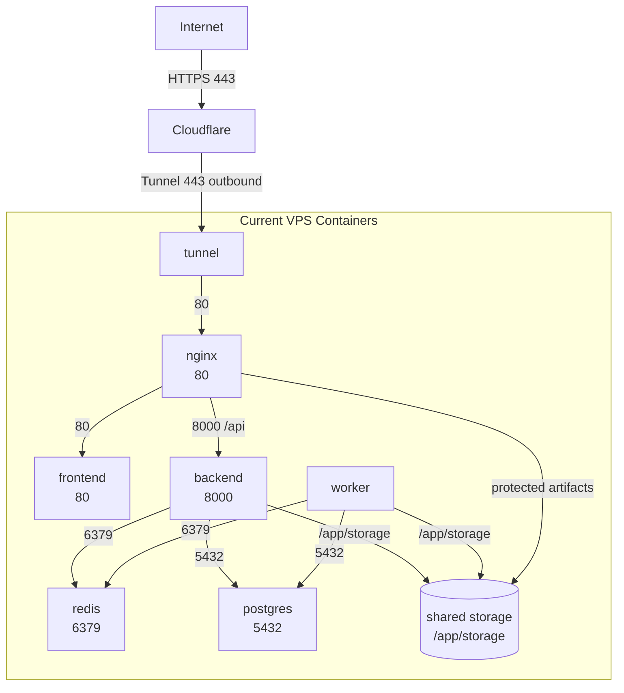

### Current Implementation: Host Port Mapping
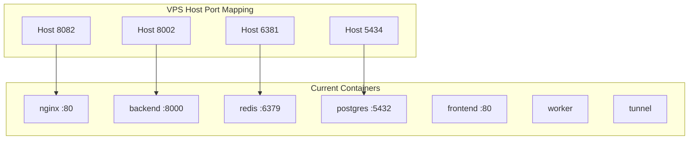

## 24. Why Backend And Worker Are Separate

### Core Idea
- `backend` is the user-facing API service
- `worker` is the background processing service
- they are related, but they are not the same runtime role

### Backend Responsibility
Backend handles:
- authentication
- uploads
- session retrieval
- review/edit requests
- export initiation
- job submission

Backend should respond quickly and should not spend long periods doing heavy processing inside a user request.

### Worker Responsibility
Worker handles:
- transcript interpretation
- workflow processing
- screenshot extraction
- long-running generation tasks
- background export-related processing

Worker is not user-facing and does not normally expose an API port to end users.

### Why They Are Split
If backend also performed all heavy generation work directly:
- API latency would increase
- requests could time out
- heavy jobs would block normal user traffic
- scaling would become inefficient

Separating backend and worker allows:
- responsive APIs
- asynchronous job execution
- independent scaling
- better fault isolation

## 25. How Backend And Worker Actually Interact

### Producer-Consumer Model
- backend acts as the **job producer**
- worker acts as the **job consumer**
- Redis acts as the **queue / broker**

### Important Architectural Point
- backend and worker usually do **not** connect directly to each other
- both connect to:
  - Redis
  - PostgreSQL
  - storage

This means Redis decouples backend and worker.

### Request Flow
1. User clicks `Generate Draft`
2. Frontend calls backend
3. Backend validates request
4. Backend pushes job into Redis queue
5. Any available worker picks the job from Redis
6. Worker processes transcript / screenshots / workflow steps
7. Worker writes results to PostgreSQL and storage
8. Frontend later asks backend for updated session state
9. Backend reads updated state from PostgreSQL and returns it

### Polling Model
- frontend usually polls backend for status updates
- backend does not normally keep polling worker directly
- backend reads durable state from database and related storage-backed outputs

## 26. Queue-Decoupling Diagram

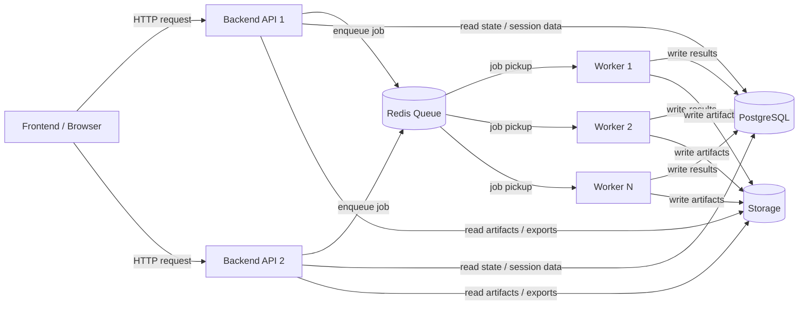

## 27. Scaling Model

### Does Worker Need A Load Balancer
- No
- workers are not serving public HTTP traffic
- workers pull jobs from Redis
- scaling workers means running more worker instances that consume from the queue

### Does Backend Need A Load Balancer
- Yes, usually
- if multiple backend instances are deployed, incoming API traffic needs one stable entry point
- traffic is then distributed across backend instances by:
  - nginx
  - ingress controller
  - load balancer

### How Multiple Backend Instances Work With Multiple Workers
- multiple backends can all submit jobs into the same Redis queue
- multiple workers can all pull jobs from that same Redis queue
- no backend needs to know which worker will execute the job
- no worker needs to know which backend originally created the job

### What Redis Is Doing
Redis provides:
- queue buffering
- producer-consumer decoupling
- asynchronous execution model
- worker competition for available jobs
- easier horizontal scaling

## 28. Simple Analogy
- backend:
  - front desk receiving requests
- Redis:
  - tray of queued work items
- worker:
  - back-office team picking the next available work item

This is why:
- backend scaling improves request responsiveness
- worker scaling improves job throughput

## 29. Architecture Style Classification

### Short Answer
This application follows a:
- containerized
- multi-tier
- service-oriented
- asynchronous web architecture

with a:
- producer-consumer background processing model

### Best One-Line Description
This is a **containerized multi-tier service-oriented architecture with asynchronous producer-consumer background processing**.

### What That Means In Practical Terms
- `presentation tier`
  - frontend SPA
- `ingress / reverse proxy tier`
  - nginx or enterprise ingress
- `application tier`
  - backend API
- `background processing tier`
  - worker pool
- `data tier`
  - PostgreSQL, Redis, storage

### Architectural Patterns In Use
#### 1. Multi-tier architecture
The solution is split into clear runtime tiers:
- frontend
- backend
- worker
- database / queue / storage

#### 2. Service-oriented architecture
The major runtime responsibilities are separated into independently deployable services:
- frontend
- backend
- worker
- nginx
- redis
- postgres

This is modular and service-oriented, though not a strict microservices platform.

#### 3. Asynchronous job-processing architecture
Long-running operations are not executed directly inside user-facing HTTP requests.

Instead:
- backend accepts the request
- backend submits a job to the queue
- worker processes the job asynchronously

#### 4. Producer-consumer pattern
- backend acts as producer
- worker acts as consumer
- Redis acts as queue / broker

#### 5. Stateless application scaling
Backend and worker services are designed to scale horizontally, while durable state lives in:
- PostgreSQL
- Redis
- storage

### If Asked: Monolith Or Microservices
The most accurate answer is:

This is **not a pure microservices architecture**. It is a **modular service-oriented application** with clearly separated web, API, worker, and data services, plus asynchronous processing for long-running workloads.

### Meeting-Friendly Answer
If someone asks in a review meeting:

> What architecture style are you following?

Answer:

> We are following a containerized multi-tier service-oriented architecture, with asynchronous background processing using a producer-consumer queue pattern.

## 30. End-To-End Processing Flow For Draft And Screenshot Generation

### Important Clarification
In the current implementation:
- `draft generation` is one queued worker job
- `screenshot generation` is a separate queued worker job

So the current system does **not** run screenshots as part of the same worker pipeline that generates the draft.

The actual user flow is:
1. upload transcript(s), video(s), and template
2. request draft generation
3. worker completes draft-generation pipeline
4. user reviews generated draft
5. user requests screenshot generation
6. worker completes screenshot-generation pipeline
7. user reviews / edits / exports

### High-Level Request Flow
```mermaid
flowchart TB
    User -->|upload files| Frontend
    Frontend -->|/api/uploads| Backend
    Backend --> Storage
    Backend --> PostgreSQL

    User -->|Generate Draft| Frontend
    Frontend -->|/api/draft-sessions/{id}/generate| Backend
    Backend -->|enqueue draft job| Redis
    Redis -->|draft_generation.run| Worker
    Worker --> PostgreSQL
    Worker --> Storage

    User -->|Generate Screenshots| Frontend
    Frontend -->|/api/draft-sessions/{id}/generate-screenshots| Backend
    Backend -->|enqueue screenshot job| Redis
    Redis -->|screenshot_generation.run| Worker
    Worker --> PostgreSQL
    Worker --> Storage

    User -->|Export DOCX / PDF| Frontend
    Frontend -->|/api/exports/*| Backend
    Backend --> PostgreSQL
    Backend --> Storage
    Backend --> Frontend
```

## 31. Exact Worker Tasks Per User Request

### A. Upload Request
When user uploads transcript(s), video(s), or template:

Backend tasks:
1. authenticate user
2. validate artifact type and request
3. store uploaded file in storage
4. create artifact record in PostgreSQL
5. create Action Log entry

No worker job is involved in simple upload.

### B. Draft Generation Request
When user clicks `Generate Draft`:

Backend tasks:
1. validate session and ownership
2. verify transcript artifacts exist
3. mark session as `processing`
4. create `Draft generation queued` Action Log entry
5. enqueue Celery task:
   - `draft_generation.run`
6. return accepted response to frontend

### C. Draft Generation Worker Stages
The draft worker executes the following stages in sequence.

Source:
- [draft_generation_worker.py](C:\Users\work\Documents\PddGenerator\worker\services\draft_generation_worker.py)

#### Draft worker stage order
1. `SessionPreparationStage`
2. `EvidenceSegmentationStage`
3. `TranscriptInterpretationStage`
4. `ProcessGroupingStage`
5. `CanonicalMergeStage`
6. `DiagramAssemblyStage`
7. `PersistenceStage`

### D. What Each Draft Worker Stage Does

#### 1. SessionPreparationStage
- loads session and artifacts
- marks session processing state
- clears stale generated entities:
  - prior steps
  - prior notes
  - prior screenshots
  - prior process groups

#### 2. EvidenceSegmentationStage
- normalizes transcript text
- segments transcript evidence
- enriches segments with workflow signals
- performs workflow-boundary classification
- records segmentation Action Log metadata

This is where:
- AI-assisted boundary classification may run
- heuristic fallback may run if AI is unavailable or weak

#### 3. TranscriptInterpretationStage
- reads normalized transcript text
- calls AI transcript interpreter if enabled
- otherwise falls back to deterministic extraction
- produces:
  - step candidates
  - note candidates
- groups extracted output by transcript

This is the main transcript-to-steps processing stage.

#### 4. ProcessGroupingStage
- groups transcript outputs into process/workflow groups
- uses:
  - workflow signals
  - AI-assisted title resolution
  - AI-assisted workflow match where enabled
  - heuristic fallback
- records grouping Action Log metadata

#### 5. CanonicalMergeStage
- merges grouped transcript outputs into the current canonical process view
- consolidates session-wide step and note output

#### 6. DiagramAssemblyStage
- generates the diagram model for the canonical process
- prepares diagram structures used by review and export

#### 7. PersistenceStage
- writes final generated steps and notes into PostgreSQL
- updates session state
- finalizes review-ready output

### E. Screenshot Generation Request
When user clicks `Generate Screenshots`:

Backend tasks:
1. validate session ownership
2. verify process steps already exist
3. verify video artifacts exist
4. acquire screenshot generation lock
5. create `Screenshot generation queued` Action Log entry
6. enqueue Celery task:
   - `screenshot_generation.run`
7. return accepted response

### F. Screenshot Generation Worker Stages
Source:
- [screenshot_generation_worker.py](C:\Users\work\Documents\PddGenerator\worker\services\screenshot_generation_worker.py)

Current screenshot worker flow:
1. load session and persisted canonical steps
2. prepare screenshot context
3. delete old screenshot candidates and previous selected screenshots
4. resolve transcript-to-video pairing
5. derive screenshot candidates using `ffmpeg`
6. attach selected screenshot metadata to canonical steps
7. persist screenshot records
8. create `Screenshots ready` Action Log entry

### G. Where Video Chunking / Snapshot Extraction Happens
Video processing runs inside the worker, not in backend.

Source:
- [video_frame_extractor.py](C:\Users\work\Documents\PddGenerator\worker\services\video_frame_extractor.py)

It uses:
- `ffmpeg`
- `ffprobe`

Worker-side screenshot extraction tasks include:
1. resolve target video for transcript / process group
2. build candidate timestamps
3. call `ffmpeg` to extract image frames
4. store image outputs in storage
5. persist screenshot candidate metadata
6. mark selected screenshot(s) for steps

### H. Export Request
When user clicks `Export DOCX` or `Export PDF`:

Backend tasks:
1. validate session ownership
2. load reviewed session data
3. render DOCX template
4. if PDF requested:
   - convert DOCX to PDF
   - use `docx2pdf` or `LibreOffice`
5. store output document in storage
6. create export Action Log entry
7. stream file back to frontend

## 32. Full End-To-End Sequence Diagram

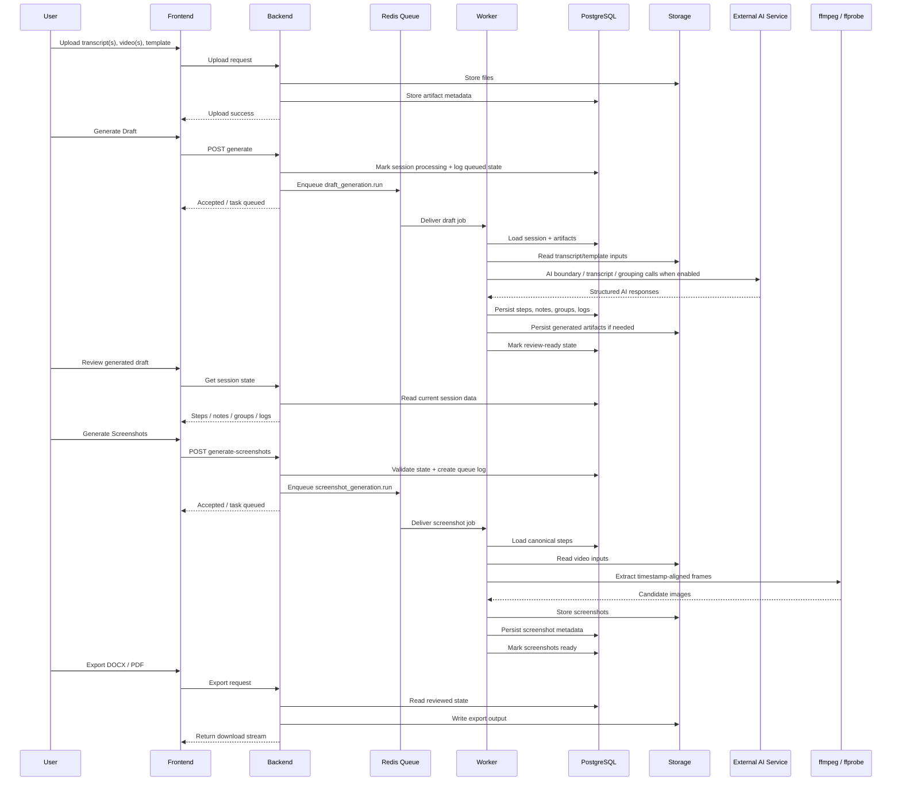

## 33. Parallelism Vs Sequence

### Within One Draft Job
Current draft-generation stages run mostly in sequence:
1. preparation
2. segmentation
3. transcript interpretation
4. grouping
5. merge
6. diagram
7. persistence

### Within One Screenshot Job
Current screenshot-generation flow is also mostly sequential per session.

### Across Multiple Jobs
Parallelism happens across jobs, not inside one session pipeline.

Examples:
- session A draft generation can run on worker 1
- session B draft generation can run on worker 2
- session C screenshot generation can run on worker 3

So:
- per-session pipeline = mostly sequential
- multi-session workload = parallel across worker pool

## 35. How Redis And Celery Work Together

### Core Question
In this application, queueing is not handled by Redis alone.

The responsibilities are split across:
- `Redis`
- `Celery`
- `Worker`
- `PostgreSQL`

### Simple Breakdown
#### Redis
Redis acts mainly as:
- broker
- queue message store
- temporary holding area for queued jobs
- lightweight lock store

Redis is **not** the full workflow engine by itself.

#### Celery
Celery acts as:
- task execution framework
- producer-consumer orchestration layer
- retry and task lifecycle manager
- worker coordination system
- queue routing mechanism

Celery defines:
- what a task is
- how a task is serialized
- which queue it goes to
- how workers pick it up
- what happens on retry / failure / success

#### Worker
Worker is the execution engine that actually performs the processing:
- transcript interpretation
- workflow grouping
- screenshot extraction
- background processing

#### PostgreSQL
PostgreSQL stores the durable business state:
- sessions
- artifacts
- generated steps
- generated notes
- process groups
- action logs
- exports

### Responsibility Split
| Component | Responsibility |
|---|---|
| `Redis` | holds queued task messages |
| `Celery` | manages task execution lifecycle |
| `Worker` | executes the actual background work |
| `PostgreSQL` | stores durable application state |

### Practical Flow
1. frontend sends request to backend
2. backend decides heavy work should run asynchronously
3. backend asks Celery to queue a task
4. Celery serializes task payload and stores it in Redis
5. worker asks Celery for the next available task
6. Celery worker pulls the task message from Redis
7. worker executes the real processing logic
8. worker writes durable results to PostgreSQL and storage
9. frontend later asks backend for updated state
10. backend reads that state from PostgreSQL

### Important Architectural Point
Backend and worker usually do **not** call each other directly.

They are decoupled by Redis and coordinated through Celery.

### Restaurant Analogy
- backend:
  - waiter/front desk taking order
- Redis:
  - ticket rack where orders wait
- Celery:
  - kitchen management system deciding how orders are routed and processed
- worker:
  - chef cooking the order
- PostgreSQL:
  - official business records and final order history

### Courier Analogy
- backend:
  - parcel booking desk
- Redis:
  - parcel holding/sorting bin
- Celery:
  - dispatch system managing delivery lifecycle
- worker:
  - delivery agent doing the actual work
- PostgreSQL:
  - official shipment records

### Meeting-Friendly Explanation
If asked:

> Is Redis the queue manager?

The best answer is:

> Redis is the broker and temporary queue store, but Celery is the task orchestration framework that manages how jobs are submitted, picked up, retried, and completed. The worker executes the job, and PostgreSQL stores the durable business state.

## 34. Slide-Ready Worker Processing Diagram

### Vertical Color-Coded Worker Flow
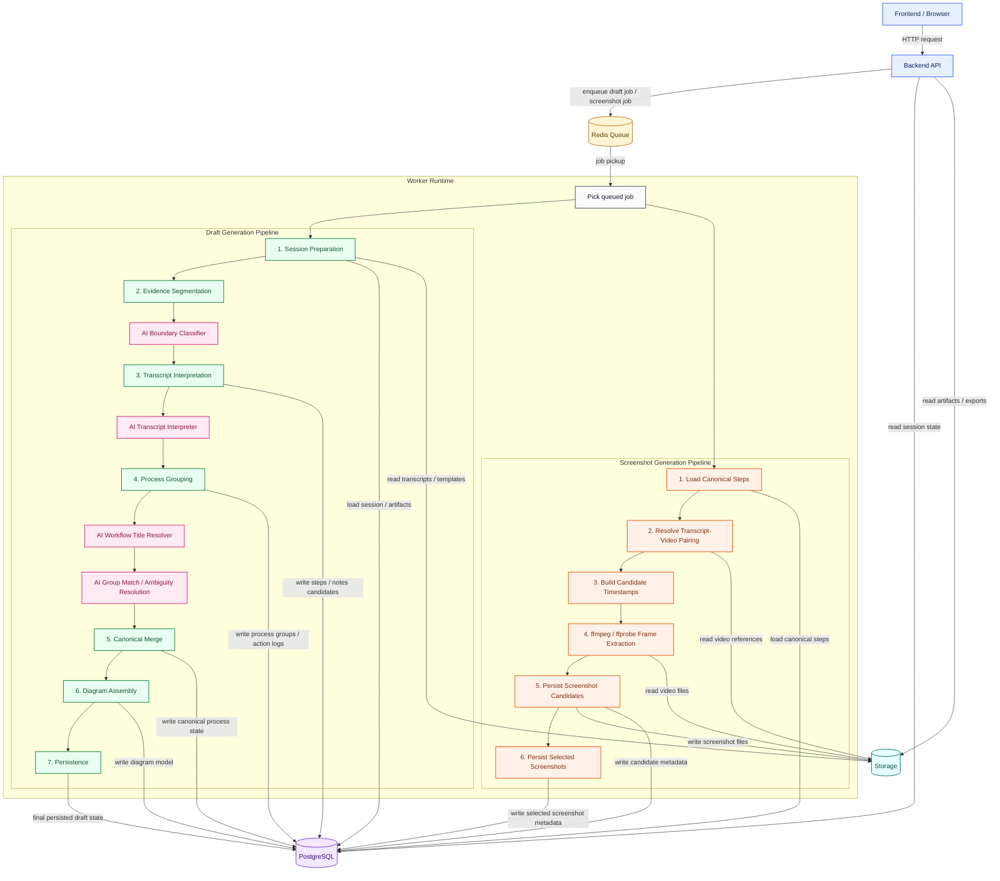

### Reading Guide
- blue:
  - user-facing request path
- yellow:
  - queue / broker
- green:
  - draft-generation stages
- pink:
  - AI-assisted stages
- orange:
  - screenshot / video processing stages
- purple:
  - database
- teal:
  - file storage

### Important Note
- `Draft generation` and `Screenshot generation` are currently two separate queued jobs
- this diagram places both inside the worker runtime because both are executed by the worker tier
