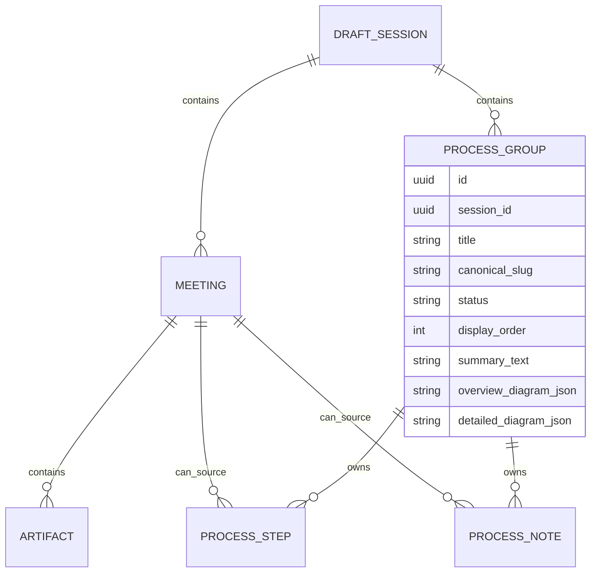

# Multi-Process Session Design

This document defines the target behavior for sessions that contain multiple meetings and multiple business processes.

It replaces the overly simple assumption that one session always produces one canonical process.

## Problem

One SME session can cover:

- one process described across multiple meetings
- multiple distinct processes described across multiple meetings
- a mix of refinement, contradiction, and net-new process walkthroughs

The current worker pipeline only supports:

- one session
- one canonical step list
- one canonical note list
- one screenshot derivation path
- one summary bias

That breaks when unrelated processes are uploaded into the same session.

### Example Failure

Session:

- Meeting 1: Sales Order creation
- Meeting 2: Purchase Order creation

Current behavior:

- textual steps may still look superficially ordered
- screenshot ownership can be wrong
- summary can overrepresent the first process
- later process steps can inherit screenshots from the earlier process

This is not a screenshot-only bug. It is a session modeling problem.

## Product Rule

One session may contain multiple business processes.

The application must:

- merge incrementally only when a new meeting belongs to an existing process
- append separately when a new meeting introduces a different process
- preserve earlier process steps when a different process is added later

## Core Rule Set

### Rule 1. Same Process

If a new meeting belongs to an existing process:

- improve matching steps
- update conflicting steps using latest evidence
- insert genuinely new steps at the right position
- regenerate summaries, diagrams, and screenshots only for that process group

### Rule 2. Different Process

If a new meeting describes a different process:

- do not rewrite the old process
- create a new process group inside the same session
- append the new process group separately
- generate separate summary, diagram, and screenshot context for the new group

### Rule 3. Session Is a Container

Session should be treated as:

- engagement container
- evidence container
- export container

Not as:

- a single forced process list

## Target Data Model

### Existing

- `draft_session`
- `meeting`
- `artifact`
- `process_step`
- `process_note`

### Required New Entity

- `process_group`

Conceptually:

## Required Ownership Rules

### Process Step

Each persisted step should belong to:

- `session_id`
- `process_group_id`
- `meeting_id`

Meaning:

- session tells where it lives
- process group tells which process it belongs to
- meeting tells which meeting last authored or won that step

### Process Note

Each persisted note should belong to:

- `session_id`
- `process_group_id`
- `meeting_id`

### Screenshot

Each screenshot should remain step-owned, but the selected screenshot must always be derived from the correct process-group step lineage.

## Generation Pipeline

The current pipeline:

1. normalize transcripts
2. extract all steps
3. flatten into one canonical list
4. derive screenshots
5. build one summary and one diagram

The target pipeline must be:

1. normalize transcripts per meeting
2. extract step/note candidates per transcript
3. cluster extracted evidence into process groups
4. merge only within each process group
5. derive screenshots within each process group
6. generate summary within each process group
7. generate diagrams within each process group
8. persist session + process groups + steps + notes + screenshots

## Process Clustering Logic

Clustering should use AI plus deterministic guardrails.

### Input

- transcript-derived steps
- transcript-derived notes
- application names
- action text
- supporting transcript text
- meeting order

### Output

For each extracted step:

- assign to existing `process_group`
- or create a new `process_group`

### AI Responsibility

AI should answer:

- is this step part of an existing business workflow already seen in this session?
- if yes, which one?
- if no, should a new process group be created?

### Deterministic Guardrails

- different process groups cannot share step ownership
- one new meeting can contribute to multiple groups if transcript truly covers multiple workflows
- step ordering remains per process group, not global session-only ordering

## Merge Logic Within a Process Group

Once a step is classified into an existing process group:

- compare against existing group steps
- same step -> update latest wording/evidence
- conflicting step -> replace or supersede old version
- new step -> insert in sequence

This is where canonical merge belongs.

Canonical merge should never operate across unrelated process groups.

## Summary Logic

Summary must follow the same process-group rule.

### Current Problem

Current frontend summary uses:

- first note
- first few steps

That creates summary bias for whichever process dominates the front of the flat list.

### Correct Behavior

Each `process_group` gets its own:

- summary heading
- summary bullets
- note count
- application context

At session level, UI can either:

- show one selected process summary
- or show a summary per process group card

### Export Rule

The DOCX export must not flatten all groups into one misleading narrative.

It should either:

- export one selected process group
- or render multiple sections such as:
  - Process 1: Sales Order creation
  - Process 2: Purchase Order creation

## Screenshot Logic

Screenshot derivation must also follow process groups.

### Current Problem

When one flat canonical list is used, a step may inherit transcript ownership from one process and screenshot selection from a mismatched video lineage.

### Correct Behavior

For each process group:

- derive screenshots only for steps in that group
- step ownership decides transcript/video lineage
- screenshot selection must come from the winning step's source meeting or matched evidence

Meaning:

- Sales Order steps get Sales Order screenshots
- Purchase Order steps get Purchase Order screenshots

Never cross-pollinate.

## Diagram Logic

Each process group gets:

- one overview diagram
- one detailed diagram

Session UI may show:

- process group selector
- then corresponding diagram

The application must not build one mixed diagram from unrelated processes.

## UI Model

### Session Detail

Session Detail should become:

- session shell
- process group switcher
- selected process review/edit area

### My Projects

Session card remains one card per session.

Inside session detail:

- `View`
  - Summary
  - Process
  - Diagram
  - Ask
  - Action Log
- `Edit`
  - Process
  - Diagram
  - Meetings

## Clarified Product Rules

The following rules reflect the agreed product direction more precisely than the earlier broad discussion.

### Rule 4. One Session, One Export

One session always produces one export.

Even when a session contains multiple independent workflows, the application should still treat the session as:

- one export container
- one SME engagement container
- one evolving body of evidence

The export must therefore remain:

- one DOCX/PDF per session

But the contents inside that export must be separated process-wise.

Example:

- Process 1: Purchase Order Creation
- Process 2: Sales Order Creation
- Process 3: Vendor Management

Each process section inside the same export should contain its own:

- summary
- steps
- screenshots
- diagram
- notes

This prevents two wrong extremes:

- splitting one SME engagement into many unrelated export files
- flattening all workflows into one misleading mixed narrative

### Rule 5. Same Process Updates the Existing Process Group

If new uploaded evidence belongs to a process that already exists inside the session, the application must update that existing process group only.

Example:

- session already contains:
  - Purchase Order
  - Sales Order
  - Vendor Management
- new upload is another Purchase Order walkthrough

Then the correct behavior is:

- update Purchase Order only
- do not create a second Purchase Order tab
- do not modify Sales Order
- do not modify Vendor Management

This means the real system decision is:

- does this new evidence belong to an existing process group?

If yes:

- merge into that process group only

If no:

- create a new process group

### Rule 6. Different Process Creates a New Process Group

If new uploaded evidence represents a different business workflow from everything already present in the session, the application must create a new process group.

Example:

- session already contains:
  - Purchase Order
  - Sales Order
- new upload is about Vendor Management

Then:

- create Vendor Management as a new process group
- keep Purchase Order unchanged
- keep Sales Order unchanged

### Rule 7. Unrelated Process Groups Must Never Be Disturbed

When one process group is updated, unrelated process groups must remain untouched.

That includes:

- steps
- notes
- screenshots
- diagrams
- summaries

This rule is critical for trust.

If a user uploads a new Purchase Order recording, they must not see:

- Sales Order screenshots change
- Vendor Management diagrams change
- a duplicate Purchase Order process appear

## Current Versus Future Regeneration Model

### Current Model

The current implementation still recreates the session draft from scratch when draft generation is triggered.

That means:

- all available evidence is re-read
- all process groups are reconsidered
- all steps/notes are rebuilt for the session

This is acceptable for the current pilot, but it is not the desired long-term behavior.

### Future Model

The target model is incremental regeneration at the process-group level.

If new uploaded evidence belongs to an existing process group, the system should:

- update only that process group
- regenerate only that process group's steps
- regenerate only that process group's notes
- regenerate only that process group's summary
- regenerate only that process group's screenshots
- regenerate only that process group's diagram

All unrelated process groups must remain untouched.

If new uploaded evidence belongs to a new process group, the system should:

- create a new process group
- generate only the new process group's outputs
- append it into the session export structure

### Clear Statement of Future Requirement

The future product requirement is:

- incremental per-process updates
- not full session recreation from scratch

This requirement is explicit and should guide future backend refactors.

## Implementation Direction for the Incremental Future

To support the desired future behavior, the system will need to evolve toward:

1. process-group-level ownership of generated artifacts
2. process-group-level change detection
3. process-group-level regeneration jobs
4. export assembly that reads all stable process groups without forcing a global rebuild

In practice that means:

- new evidence must first be classified into an existing or new process group
- only the impacted process group should be invalidated
- regeneration should operate only on that impacted process group
- export should remain session-wide, but built from stable process-group sections

This is the correct long-term architecture for:

- one session
- many uploads over time
- one export
- many process groups

But the selected process group must be explicit in the UI.

### Meetings Tab

Meetings tab remains for:

- attaching new transcript/video evidence
- selecting which meeting to extend

It should not be responsible for solving process clustering in the UI. That belongs to generation and session review state.

## Minimal Safe Implementation Plan

### Phase 1. Introduce Process Group Entity

- add `process_group` table
- add `process_group_id` to steps and notes
- keep current session model intact

### Phase 2. Cluster Before Merge

- cluster extracted meeting steps into process groups
- merge only within the group

### Phase 3. Persist Per-Group Summary and Diagram

- generate summary per group
- generate diagram per group

### Phase 4. Screenshot Ownership Fix

- derive screenshots per process group
- ensure selected screenshots never cross process boundaries

### Phase 5. UI Group Selector

- show process groups within session detail
- allow BA to switch between them

## Interim Guardrail Until Full Implementation

Until process groups are implemented, current output should be treated as unsafe when:

- one session contains obviously different workflows
- screenshots appear mismatched
- summary heavily favors one workflow

This is expected with the current flat-canonical-session architecture.

## Non-Negotiable Outcome

The final rule set must be:

- same process across meetings -> incremental merge
- different process across meetings -> append as a new process group
- summary follows process group boundaries
- screenshot derivation follows process group boundaries
- diagram follows process group boundaries

Anything else will continue to produce misleading PDDs.
