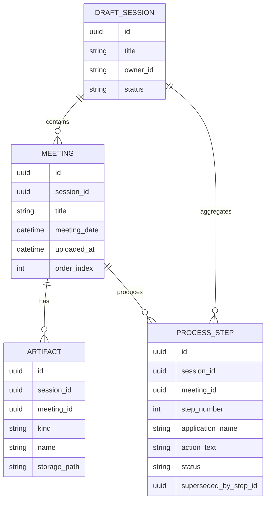
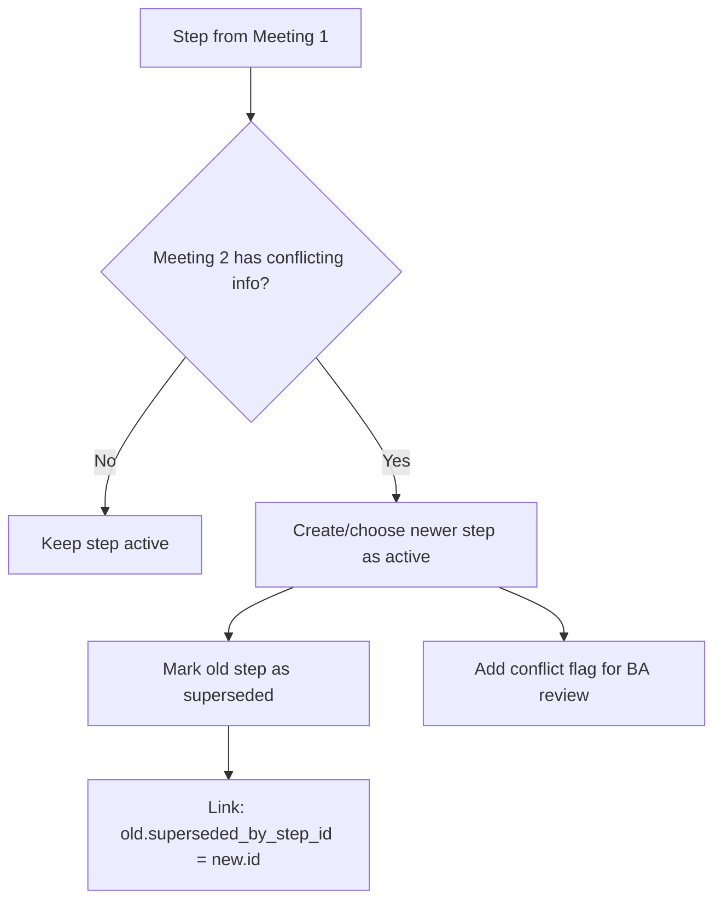
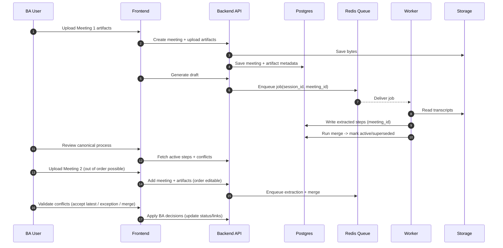

# Multi-Meeting Process Sessions (Design + Implementation)

## Problem (real-world)
One process can be discussed across multiple meetings. New meetings can:
- arrive out of order
- correct or reject earlier statements
- introduce new applications (App1 -> App2 -> App3)
- add exception flows

Goal:
- maintain one canonical current process (latest wins)
- keep provenance so BA can validate and override
- never lose earlier evidence (no hard deletes)

---

## Key Principle
Treat extracted steps as evidence-backed hypotheses.
- Canonical view shows only `active` steps (current truth).
- Old steps are not deleted; they are marked `superseded/rejected/duplicate` with links and evidence.

---

## Data Model (simple)

### Entities
- `DraftSession` (process container)
- `Meeting` (one meeting instance, ordered)
- `Artifact` (video/transcript/template/screenshot/diagram/export) linked to a meeting
- `ProcessStep` linked to meeting + evidence + lifecycle status

### Mermaid: conceptual ER view

Notes:
- `meeting_date` optional; if missing, fallback to `uploaded_at`.
- `order_index` is BA override for meeting ordering.
- `ProcessStep.status` values: `active | superseded | rejected | duplicate`.

---

## Ordering Rules (latest wins, BA can override)

### Meeting ordering
Default order:
1. `meeting_date` (if present)
2. else `uploaded_at`

BA override:
- set `order_index` explicitly (drag/drop meetings).

### Step ordering within the canonical process
Start simple:
- order by meeting order, then within-meeting extracted order.
- BA can reorder steps later (existing step edit UI can be extended).

---

## Contradictions Handling (do not delete, supersede)
If Meeting 2 corrects Meeting 1:
- mark old step as `superseded`
- point it to the new step via `superseded_by_step_id`
- keep evidence references so BA can see why

### Mermaid: conflict lifecycle

BA options on conflict:
- Accept latest (default)
- Keep old as exception (branch)
- Keep old as historical note
- Merge wording (combine)
- Reject new (rare; if meeting 2 is wrong)

---

## Multi-Application Flows (App1 -> App2 -> App3)
Each step must store:
- `application_name` (and optionally screen/context later)

Canonical sequence can still be linear for export, but the underlying model should allow:
- app switches
- validation substeps
- exception branches

We can evolve later to a graph model (nodes/edges), but day-1 can stay a list with good evidence + links.

---

## Implementation Plan (low risk, incremental)

### Phase A: Add `Meeting` + links
1. Create `meetings` table
2. Link `artifacts.meeting_id`
3. Link `process_steps.meeting_id`

### Phase B: Capture lifecycle fields on steps
1. Add `status` to `process_steps`
2. Add `superseded_by_step_id` (nullable)
3. Ensure evidence refs include transcript timestamps/snippets

### Phase C: Extraction per meeting
Worker extracts steps per meeting:
- store extracted order (local step order)
- store app hints if possible

### Phase D: Merge job (canonical builder)
Run on new meeting ingestion:
1. Load all steps for the session
2. Group similar steps:
   - app name + verb + similarity on action_text
3. For each group:
   - pick latest meeting's step as `active`
   - mark older ones `superseded` linking to winner
4. Produce a "conflicts list" for BA (only when meaningful change)

### Phase E: BA UX
Add to review screen:
- Meeting timeline (reorder meetings)
- Canonical steps (active)
- Conflicts panel (old vs new with evidence)

---

## Mermaid: end-to-end workflow

---

## What we should build first (MVP)
- meetings table + meeting ordering
- meeting_id linkage to artifacts + steps
- latest-wins merge pass (active/superseded)
- conflict list for BA validation

