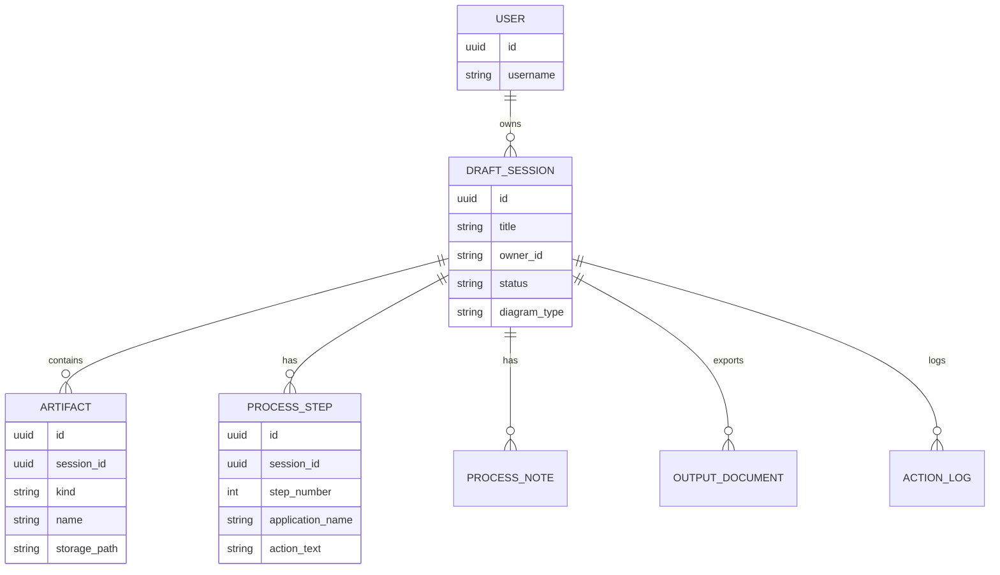
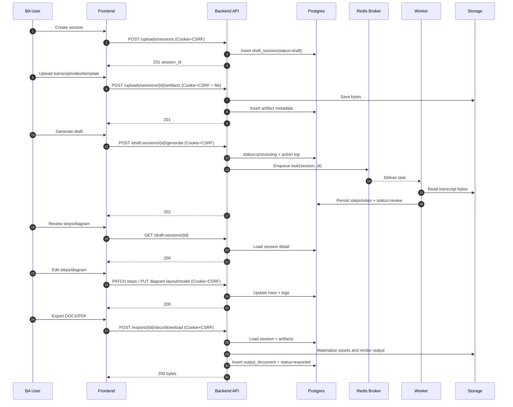

# Scenario 00a: Single Meeting Baseline (Current App Approach)

## Problem Statement
One process recording is captured in a single meeting:
- one video recording (optional)
- one transcript
- one template

Goal:
- extract steps + notes
- show review UI (steps/diagram/ask)
- export DOCX/PDF

This is the current baseline flow your app supports.

---

## Key Principles
- One `DraftSession` is the unit of work.
- Artifacts belong to the session.
- Worker generates draft steps asynchronously.
- BA can edit steps and diagrams before export.
- Exports are generated on demand and stored as output documents.

---

## Data Model (Conceptual ER)

---

## Logic (Baseline Workflow)

### Upload prerequisites
Minimum required artifacts for generation:
- transcript
- video
- template

### Generation (async)
- Backend marks session `processing` and enqueues a worker task.
- Worker reads transcript from storage and extracts:
  - `process_steps`
  - `process_notes`
  - screenshot mappings/candidates (if available)
- Worker sets session status to `review`.

### Review + edit
- BA can edit:
  - process steps text/metadata
  - diagram layout/model
  - screenshot selection order

### Export
- Backend renders DOCX/PDF using:
  - stored template
  - steps/notes
  - optional saved diagram image
- Stores output document metadata and returns bytes for download.

---

## Sequence Diagram (Single Meeting Happy Path)

---

## Notes
This is the simplest production-ready flow.
Multi-meeting support extends this baseline by adding:
- a `Meeting` entity
- per-meeting extraction + merge into a canonical process

