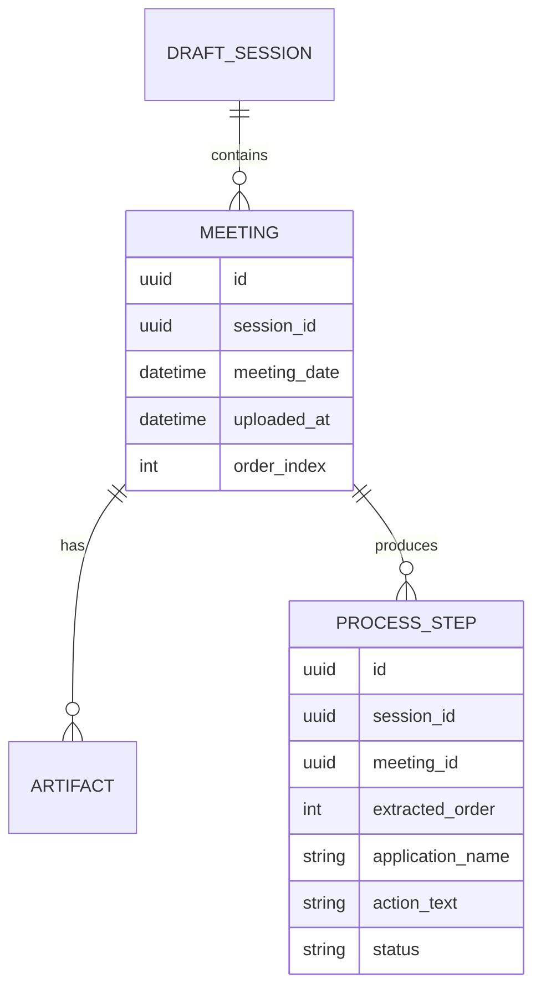
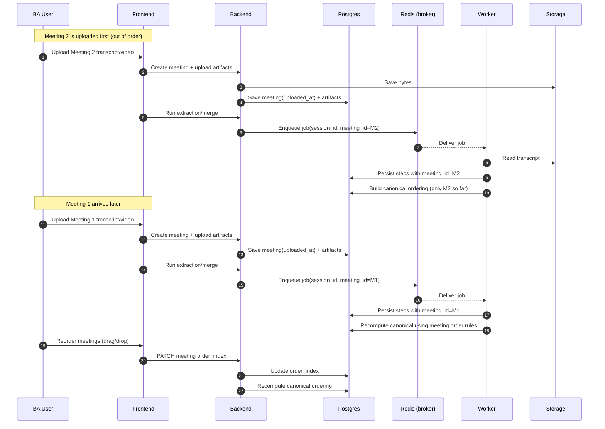

# Scenario 01: Multiple Meetings Uploaded Out Of Order

## Problem Statement
One process is recorded across multiple meetings. Meetings can be uploaded in any order (or later), but we still need a coherent sequence of process steps.

## Key Principles
- A `DraftSession` can contain multiple `Meetings`.
- Meeting order is explicit and editable (do not assume upload order).
- Steps always store provenance: `meeting_id` + evidence refs.
- Canonical process is derived from all meetings, not just one.

## Data Model (Conceptual ER)

## Logic (Ordering Rules)
- Meeting order:
  - If `order_index` is set: sort by `order_index`.
  - Else if `meeting_date` exists: sort by `meeting_date`.
  - Else: sort by `uploaded_at`.
- Step order in canonical view:
  - Sort steps by (meeting order, `extracted_order`).
- BA can reorder meetings (sets `order_index`) to correct the sequence.

## Sequence Diagram (Upload Out Of Order)

## Notes
- This scenario is solved primarily by having a first-class `Meeting` entity and explicit ordering.

