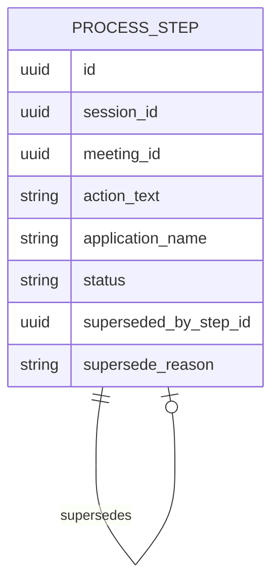
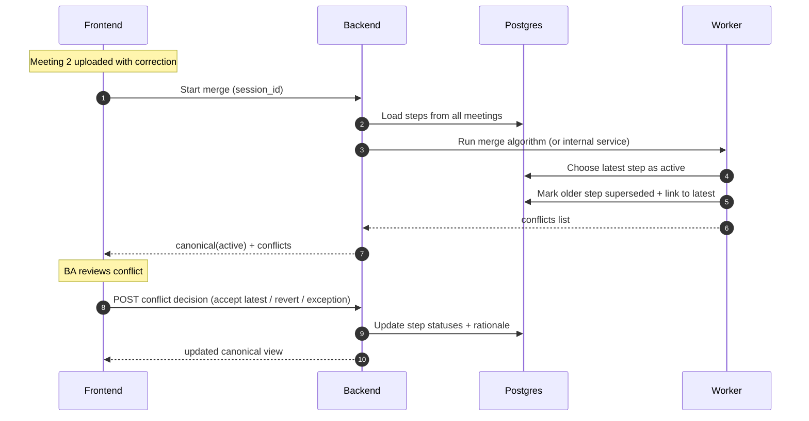

# Scenario 02: Contradictions Across Meetings (Reject/Supersede)

## Problem Statement
Meeting 1 states something, then Meeting 2 rejects or corrects it. We must keep the audit trail and still produce the latest correct process.

## Key Principles
- Never delete steps; change `status`.
- Canonical view filters `status=active`.
- A newer step can supersede an older step with a link + rationale.
- Latest wins by default, BA can override.

## Data Model (Conceptual ER)

## Logic (Latest Wins + BA Validation)
- Detect conflict candidates:
  - same application + similar verb/entity, but materially different action text
  - explicit transcript language: "we do not do this anymore", "ignore what I said"
- Default merge rule:
  - newest meeting’s step => `active`
  - older step => `superseded` and `superseded_by_step_id` points to winner
- BA can override:
  - mark winner as `rejected` and revert older to `active`
  - mark older as `exception` (variant)

## Sequence Diagram (Supersede)

## Notes
- This scenario requires the smallest additional fields: `status`, `superseded_by_step_id`, and optional `reason`.

