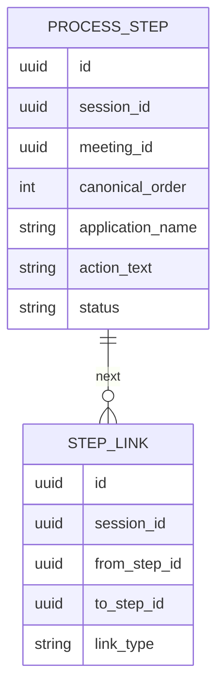
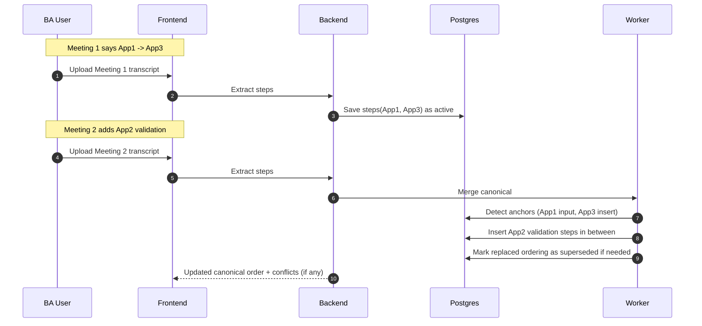

# Scenario 03: Multi-Application Chain (App1 -> App2 Validate -> App3 Insert)

## Problem Statement
A process spans multiple applications:
- input in App1
- validate in App2
- insert in App3

This chain might be revealed gradually across meetings.

## Key Principles
- Each step must store `application_name`.
- Canonical process must preserve cross-app ordering.
- Introducing a new validation app in later meetings should insert steps, not just append.

## Data Model (Conceptual ER)

## Logic (Insert Intermediate App Steps)
- When a new meeting introduces an intermediate validation app:
  - detect “before/after” anchors (App1 input, App3 insert)
  - insert App2 validation steps between the anchored steps
- If anchors are not clear:
  - flag as conflict/ambiguity for BA reordering

## Sequence Diagram (Later Meeting Adds App2)

## Notes
- The `STEP_LINK` entity is optional initially; you can keep a linear list with `canonical_order`.
- Introducing explicit links later makes diagrams/branches easier.

