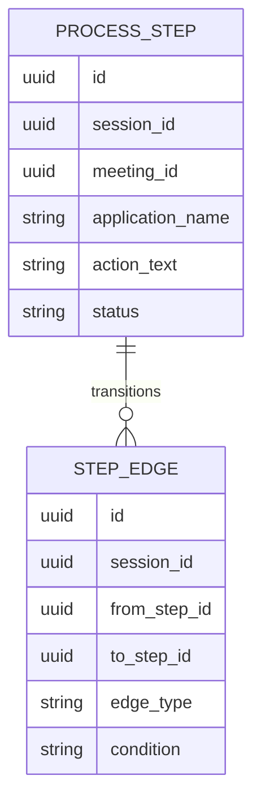
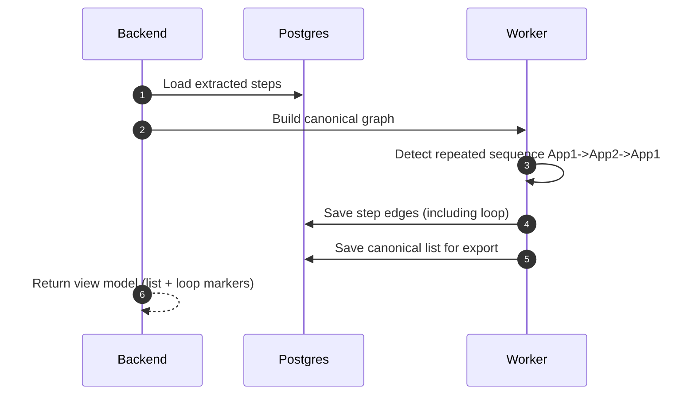

# Scenario 04: Application Switching and Loops (Back-and-Forth)

## Problem Statement
Real processes switch apps and can loop:
- App1 -> App2 -> App1 -> App3
- rework loops, retries, validations

Linear lists become confusing; we need a representation that can handle loops.

## Key Principles
- Keep canonical list for export, but store enough structure for loops.
- Support “loop” edges or markers for repeated steps.
- Preserve evidence for each loop instance.

## Data Model (Conceptual ER)

## Logic (Loop-Friendly Canonicalization)
- Extract steps as a list (simple).
- If repeated patterns are detected:
  - create `edge_type=loop` from later step back to earlier step
  - annotate `condition` if transcript indicates (e.g. "if validation fails")
- For export:
  - keep the linear “happy path” list
  - optionally include “loop notes” separately

## Sequence Diagram (Loop Detection)

## Notes
- Start with list + loop annotations; migrate to graph UI when needed.

