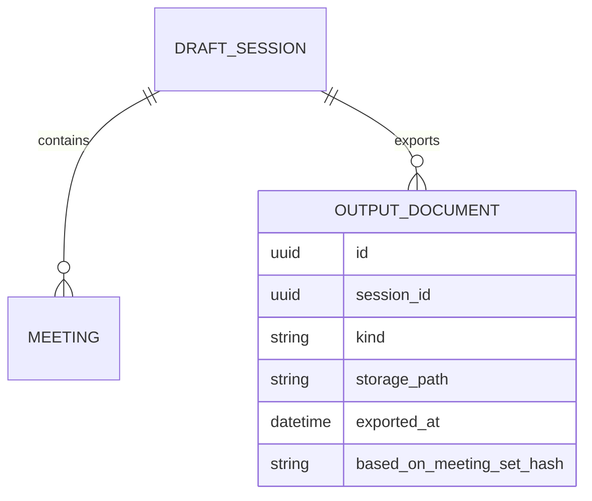
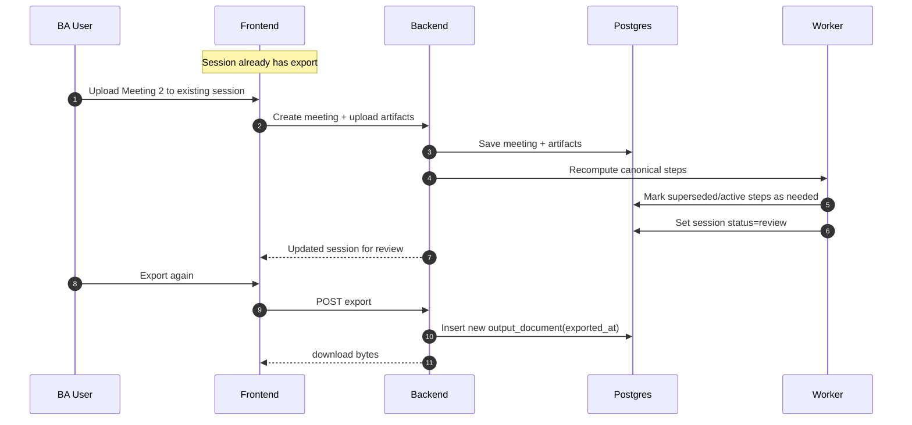

# Scenario 05: Incremental Session Updates (Add Meetings After DOC Generated)

## Problem Statement
User generates a draft after Meeting 1, then later adds Meeting 2/3 to the same session and wants the session to update.

## Key Principles
- Session is mutable; canonical steps can be recomputed.
- Exports should be versioned (store output documents and timestamps).
- Adding meetings triggers re-merge and creates a new review state.

## Data Model (Conceptual ER)

## Logic (Recompute + Keep Exports)
- When new meeting is added:
  - recompute canonical steps
  - session status moves back to `review` (if it was `exported`)
  - existing exports remain in history (do not overwrite)
- Export action creates new `output_document` row.

## Sequence Diagram (Add Meeting After Export)

## Notes
- This enables “living sessions” without losing previous documents.

