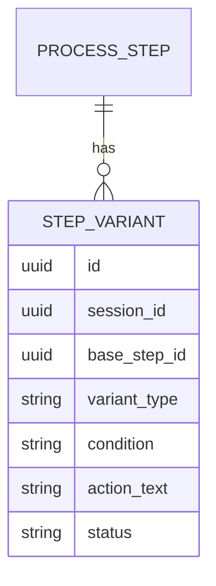
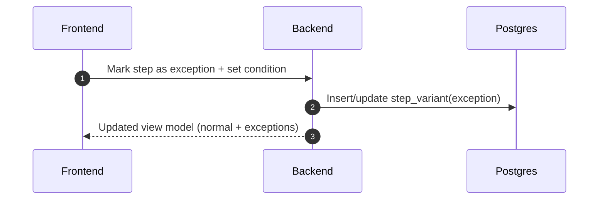

# Scenario 06: Exceptions vs Normal Flow

## Problem Statement
Meeting 2 might say: "Normally we do X, but for special cases we do Y." We must represent both without losing clarity.

## Key Principles
- Default view shows normal flow.
- Exceptions are attached as conditional branches.
- BA can classify a step as `normal` or `exception`.

## Data Model (Conceptual ER)

## Logic (Branching)
- Canonical base step stays `active` in normal flow.
- Exception steps become variants:
  - `variant_type=exception`
  - `condition` captured from transcript or BA
- Export:
  - include exceptions in a dedicated “Exceptions” section, or inline with condition text.

## Sequence Diagram (BA Classifies Exception)

## Notes
- This is optional until you see repeated exception patterns.

