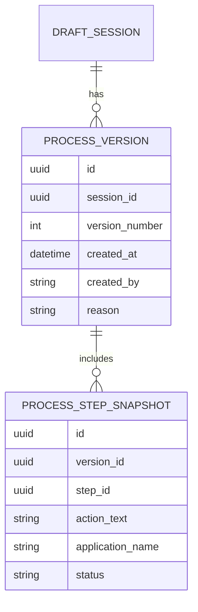
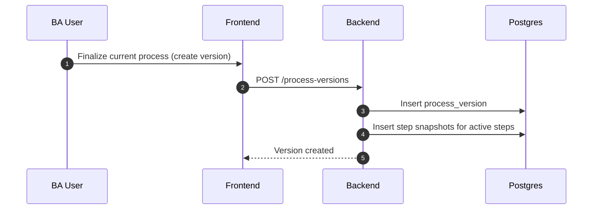

# Scenario 07: Current vs Historical Process Versions

## Problem Statement
Sometimes BA wants only current process; sometimes enterprise wants historical versions too ("what changed and when").

## Key Principles
- Start with “current-only canonical” but keep enough metadata to upgrade to history.
- Historical versioning is a filter + snapshot, not a rewrite.
- Steps are immutable in meaning; status indicates validity.

## Data Model (Conceptual ER)

## Logic (Versioning)
- Current-only mode:
  - show `status=active` steps only
- Historical mode:
  - create a new `process_version` snapshot on major updates (new meeting or BA finalize)
  - snapshot stores step ids + resolved text at that time
- Diff:
  - compare snapshot A vs snapshot B to show changes

## Sequence Diagram (Create Version Snapshot)

## Notes
- You can postpone `PROCESS_VERSION` until enterprise customers ask for audit/versioning.

