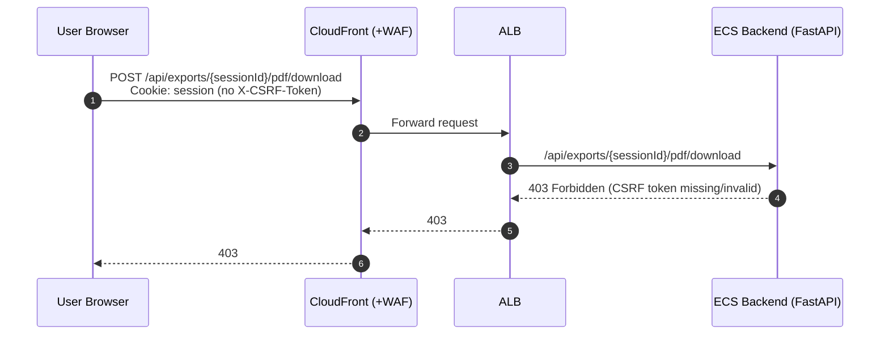
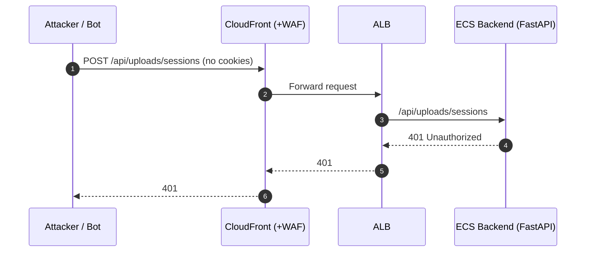
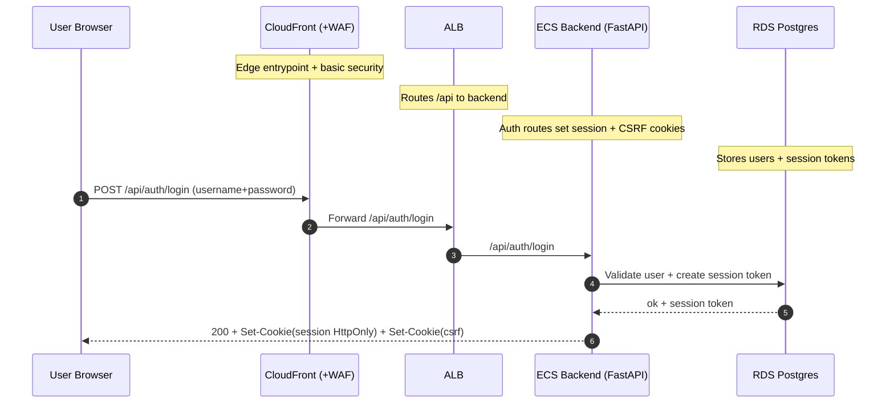
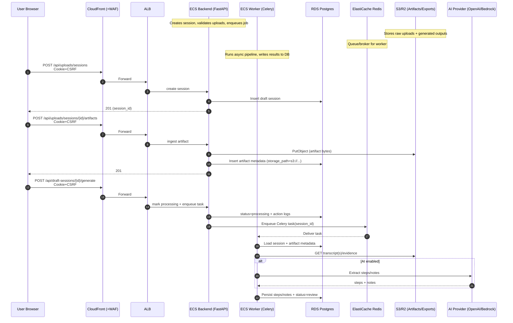
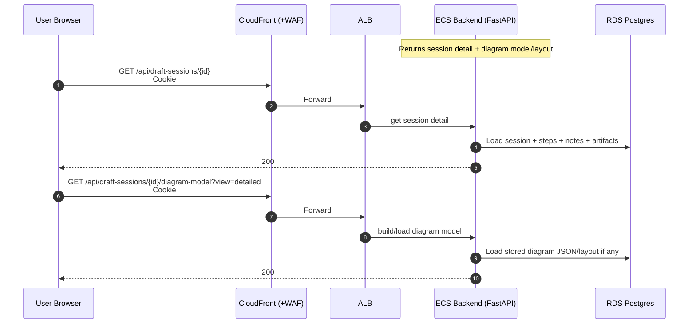
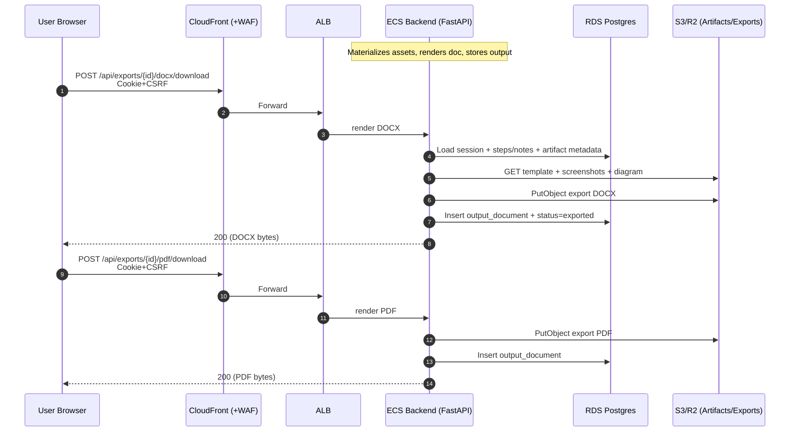
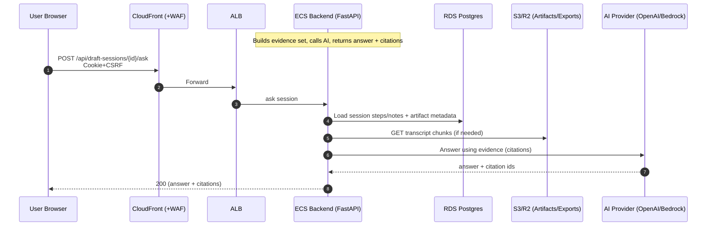

# SaaS Sequence Diagrams

## Valid Request (Cookie Auth + CSRF)

```mermaid
sequenceDiagram
    autonumber
    participant U as User Browser
    participant CF as CloudFront (+WAF)
    participant S3FE as S3 (Frontend)
    participant ALB as ALB
    participant API as ECS Backend (FastAPI)
    participant WK as ECS Worker (Celery)
    participant RDS as RDS Postgres
    participant RC as ElastiCache Redis
    participant S3OBJ as S3/R2 (Artifacts/Exports)
    participant AI as AI Provider (OpenAI/Bedrock)

    Note over CF: Purpose: edge entrypoint, caching, basic security/rate-limits
    Note over S3FE: Purpose: stores static frontend files (HTML/JS/CSS)
    Note over ALB: Purpose: routes /api traffic to backend containers + health checks
    Note over API: Purpose: auth + API business logic (sessions, uploads, exports)
    Note over WK: Purpose: long-running draft generation pipeline (async)
    Note over RDS: Purpose: main database (users, sessions, jobs, metadata)
    Note over RC: Purpose: queue/broker/cache for background jobs
    Note over S3OBJ: Purpose: durable file storage (uploads, screenshots, exports)
    Note over AI: Purpose: optional AI calls (step extraction, notes, ask)

    Note over U,CF: 1) Load UI
    U->>CF: GET /workspace
    CF->>S3FE: Fetch static assets
    S3FE-->>CF: index.html + JS/CSS
    CF-->>U: 200 (cached)

    Note over U,API: 2) Login (cookie auth + CSRF cookie)
    U->>CF: POST /api/auth/login (username+password)
    CF->>ALB: Forward /api/auth/login
    ALB->>API: /api/auth/login
    API->>RDS: Validate user + create session token
    RDS-->>API: user + session token
    API-->>ALB: 200 + Set-Cookie(session HttpOnly) + Set-Cookie(csrf)
    ALB-->>CF: 200 + Set-Cookie...
    CF-->>U: 200 + cookies stored

    Note over U,API: 3) Create session + upload artifacts (video/transcript/template)
    U->>CF: POST /api/uploads/sessions<br/>Cookie: session<br/>X-CSRF-Token: token
    CF->>ALB: Forward request
    ALB->>API: create session
    API->>RDS: Insert draft session row (owner, title, diagram type)
    RDS-->>API: session_id
    API-->>U: 201 Created (session)

    U->>CF: POST /api/uploads/sessions/{id}/artifacts<br/>Cookie: session<br/>X-CSRF-Token: token
    CF->>ALB: Forward request (cookies + header)
    ALB->>API: upload artifact
    API->>RDS: Auth via session cookie
    API->>S3OBJ: PutObject (store artifact bytes)
    S3OBJ-->>API: 200 OK
    API->>RDS: Insert artifact row (storage_path=s3://...)
    RDS-->>API: committed
    API-->>ALB: 201 Created (artifact metadata)
    ALB-->>CF: 201
    CF-->>U: 201

    Note over U,WK: 4) Generate draft (async job)
    U->>CF: POST /api/draft-sessions/{id}/generate<br/>Cookie: session<br/>X-CSRF-Token: token
    CF->>ALB: Forward request
    ALB->>API: mark session processing + enqueue job
    API->>RDS: Update session status=processing + log "queued"
    API->>RC: Enqueue Celery task (session_id)
    RC-->>WK: Worker receives task
    API-->>U: 202 Accepted (X-Task-Id)

    Note over WK: Worker pipeline stages (simplified)
    WK->>RDS: Load session + artifacts metadata
    WK->>S3OBJ: GET transcript(s)/screenshots as needed
    S3OBJ-->>WK: bytes
    alt AI enabled
        WK->>AI: Extract steps/notes + grounding metadata
        AI-->>WK: steps + notes
    else AI disabled
        WK->>WK: Deterministic parse / fallback logic
    end
    WK->>RDS: Persist process_steps, process_notes, candidates, logs
    WK->>RDS: Update session status=review
    RDS-->>WK: committed

    Note over U,API: 5) Track progress + open session (poll)
    loop Poll until ready
        U->>CF: GET /api/draft-sessions<br/>Cookie: session
        CF->>ALB: Forward request
        ALB->>API: list sessions
        API->>RDS: Select sessions + latest logs
        RDS-->>API: rows
        API-->>U: 200 (status + stage text)
    end

    U->>CF: GET /api/draft-sessions/{id}<br/>Cookie: session
    CF->>ALB: Forward request
    ALB->>API: get session detail
    API->>RDS: Load session + steps + notes + artifacts + layouts
    RDS-->>API: session payload
    API-->>U: 200 (review data)

    Note over U,API: 6) View diagram/process model
    U->>CF: GET /api/draft-sessions/{id}/diagram-model?view=detailed<br/>Cookie: session
    CF->>ALB: Forward request
    ALB->>API: build/load diagram model
    API->>RDS: Load stored diagram JSON / layout if any
    API-->>U: 200 (diagram model)

    Note over U,API: 7) Ask this session (grounded Q&A)
    U->>CF: POST /api/draft-sessions/{id}/ask<br/>Cookie: session<br/>X-CSRF-Token: token
    CF->>ALB: Forward request
    ALB->>API: ask session
    API->>RDS: Load session steps/notes + artifact metadata
    API->>S3OBJ: GET transcript text chunks
    S3OBJ-->>API: text
    API->>AI: Answer using evidence (citations)
    AI-->>API: answer + citation ids
    API-->>U: 200 (answer + citations)

    Note over U,API: 8) Modify process steps (BA edits)
    U->>CF: PATCH /api/draft-sessions/{id}/steps/{stepId}<br/>Cookie: session<br/>X-CSRF-Token: token
    CF->>ALB: Forward request
    ALB->>API: update step (text/confidence/screenshot)
    API->>RDS: Update process_step row + log action
    RDS-->>API: committed
    API-->>U: 200 (updated step)

    Note over U,API: 9) Modify diagram (save layout/model + optional image artifact for export)
    U->>CF: PUT /api/draft-sessions/{id}/diagram-layout?view=detailed<br/>Cookie: session<br/>X-CSRF-Token: token
    CF->>ALB: Forward request
    ALB->>API: save diagram layout
    API->>RDS: Upsert diagram_layout row
    API-->>U: 200

    U->>CF: PUT /api/draft-sessions/{id}/diagram-model?view=detailed<br/>Cookie: session<br/>X-CSRF-Token: token
    CF->>ALB: Forward request
    ALB->>API: save diagram model JSON
    API->>RDS: Persist edited diagram JSON + log action
    API-->>U: 200

    U->>CF: POST /api/draft-sessions/{id}/diagram-artifact<br/>Cookie: session<br/>X-CSRF-Token: token
    CF->>ALB: Forward request
    ALB->>API: save diagram image (png data URL)
    API->>S3OBJ: PutObject diagram PNG (export reuse)
    API->>RDS: Upsert diagram artifact metadata
    API-->>U: 200

    Note over U,API: 10) Export (Word/PDF)
    U->>CF: POST /api/exports/{id}/docx/download<br/>Cookie: session<br/>X-CSRF-Token: token
    CF->>ALB: Forward request
    ALB->>API: render DOCX
    API->>RDS: Load session + steps + notes + artifacts
    API->>S3OBJ: GET template + screenshots + diagram (materialize)
    API->>S3OBJ: PutObject export DOCX (store output)
    API->>RDS: Insert output_document row + status=exported
    API-->>U: 200 (DOCX bytes download)

    U->>CF: POST /api/exports/{id}/pdf/download<br/>Cookie: session<br/>X-CSRF-Token: token
    CF->>ALB: Forward request
    ALB->>API: render PDF (via temp DOCX)
    API->>S3OBJ: PutObject export PDF
    API->>RDS: Insert output_document row + status=exported
    API-->>U: 200 (PDF bytes download)
```

## Insecure Request (Missing CSRF)

## Insecure Request (Unauthenticated)

# Service Flows (Short Diagrams)

## Login

## Upload + Generate Draft

## Review (View Process + Diagram)

## Export (Word / PDF)

## Ask AI (Grounded Q&A)

