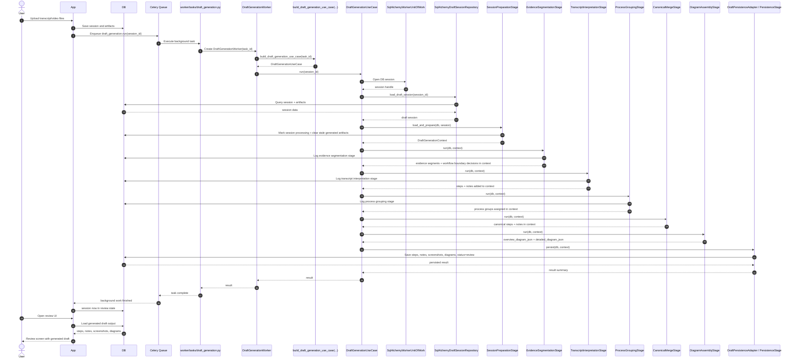
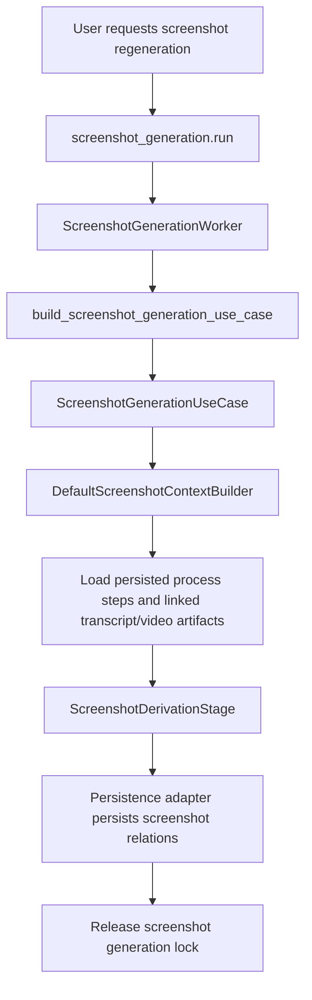

# Worker Pipeline

This file explains the worker flow in simple words.

## End-To-End Story

1. User transcript/video files upload karta hai.
2. App un files ko session ke saath save karti hai as artifacts.
3. Background task queue `draft_generation.run` start hoti hai.
4. Task `DraftGenerationWorker` ko call karti hai.
5. Worker `DraftGenerationUseCase` banata hai through orchestration composition.
6. Use case DB session open karta hai, draft session load karta hai, aur pipeline stages run karta hai.
7. Pipeline transcript ko segment karti hai, interpret karti hai, workflow groups banati hai, canonical process merge karti hai, screenshots derive karti hai if needed, aur diagrams banati hai.
8. Final stage steps, notes, screenshots, diagrams, aur session status DB me persist karti hai.
9. Session `review` state me chali jaati hai, jahan user generated output dekh sakta hai.

## Main Runtime Entry

- `worker/tasks/draft_generation.py`
  Main async task for full draft generation
- `worker/pipeline/stages/worker.py`
  Thin adapter over the draft use case
- `worker/pipeline/composition.py`
  Wires together the real dependencies and stage order
- `worker/pipeline/use_cases.py`
  Runs the orchestration flow

## What `build_draft_generation_use_case(...)` Does

This function lives in `worker/pipeline/composition.py`.

It does not generate the draft by itself.
It assembles the full draft-generation pipeline and returns a ready-to-run `DraftGenerationUseCase`.

### What It Wires

| Part | Actual class/function | What it does |
|---|---|---|
| Unit of work | `SqlAlchemyWorkerUnitOfWork` | Opens DB session and handles commit/rollback scope |
| Repository | `SqlAlchemyDraftSessionRepository()` | Loads the draft session from DB |
| Context loader | `SessionPreparationStage().load_and_prepare` | Marks session as processing, clears stale generated data, builds initial context |
| Stage 1 | `build_default_evidence_segmentation_stage()` | Builds transcript evidence segments and workflow-boundary hints |
| Stage 2 | `TranscriptInterpretationStage()` | Extracts steps and notes from transcript text |
| Stage 3 | `ProcessGroupingStage()` | Groups transcript outputs into logical workflows/processes |
| Stage 4 | `CanonicalMergeStage()` | Merges transcript-level outputs into one canonical process view |
| Stage 5 | `DiagramAssemblyStage()` | Builds overview and detailed diagram JSON |
| Persister | `DraftPersistenceAdapter()` | Saves final steps, notes, screenshots, diagrams, and session status |
| Failure recorder | `FailureRecorderAdapter()` | Marks session failed if an exception happens mid-pipeline |

### Simple Mental Model

`build_draft_generation_use_case(...)` is the wiring point:

- it chooses which dependencies to use
- it defines stage order
- it returns one executable use case object

After that, the use case runs the flow like this:

`load session` -> `prepare context` -> `run stages in order` -> `persist output`

## Mermaid Diagram

```mermaid
flowchart TD
    A[User uploads transcript/video files] --> B[App stores artifacts under a draft session]
    B --> C[App queues Celery task draft_generation.run]
    C --> D[worker/tasks/draft_generation.py]
    D --> E[DraftGenerationWorker]
    E --> F[build_draft_generation_use_case]
    F --> G[DraftGenerationUseCase]

    G --> H[Load DB session and draft session]
    H --> I[SessionPreparationStage]
    I --> I1[Clear old generated steps notes screenshots groups]

    I1 --> J[EvidenceSegmentationStage]
    J --> J1[Normalize transcript]
    J1 --> J2[Split transcript into evidence segments]
    J2 --> J3[AI or heuristic semantic enrichment]
    J3 --> J4[Workflow boundary decisions]

    J4 --> K[TranscriptInterpretationStage]
    K --> K1[AITranscriptInterpreter or fallback extractors]
    K1 --> K2[Create step and note records per transcript]

    K2 --> L[ProcessGroupingStage]
    L --> L1[ProcessGroupingService]
    L1 --> L2[Assign steps and notes to workflow groups]

    L2 --> M[CanonicalMergeStage]
    M --> M1[CanonicalProcessMergeService]
    M1 --> M2[Merge transcript-level records into canonical process]

    M2 --> N[DiagramAssemblyStage]
    N --> N1[AI diagram skill builds overview and detailed diagram JSON]

    N1 --> O[PersistenceStage]
    O --> O1[Persist process steps]
    O1 --> O2[Persist process notes]
    O2 --> O3[Persist screenshots and screenshot relations]
    O3 --> O4[Persist diagram JSON]
    O4 --> O5[Mark session as review]

    O5 --> P[User sees generated draft in review UI]
```

## End-To-End Sequence Diagram

This is the same flow in sequence form, from file upload to final review state.

## Screenshot-Only Flow

Sometimes full draft pehle se hota hai, aur sirf screenshots regenerate karne hote hain.

## Which Module Calls Which

- `worker/tasks/draft_generation.py`
  calls `worker.pipeline.stages.worker.DraftGenerationWorker`
- `worker/pipeline/stages/worker.py`
  calls `worker.pipeline.composition.build_draft_generation_use_case`
- `worker/pipeline/composition.py`
  wires:
  - `SessionPreparationStage`
  - `EvidenceSegmentationStage`
  - `TranscriptInterpretationStage`
  - `ProcessGroupingStage`
  - `CanonicalMergeStage`
  - `DiagramAssemblyStage`
  - `PersistenceStage`
- `worker/pipeline/stages/input_stages.py`
  calls `AITranscriptInterpreter` and `EvidenceSegmentationService`
- `worker/pipeline/stages/process_stages.py`
  calls `ProcessGroupingService` and `CanonicalProcessMergeService`
- `worker/pipeline/stages/output_stages.py`
  calls diagram skill, screenshot extractor, and persistence logic
- `worker/grouping/segmentation_service.py`
  handles evidence segmentation and boundary logic
- `worker/grouping/grouping_service.py`
  handles workflow grouping logic
- `worker/grouping/canonical_merge.py`
  handles canonical merging logic

## Simple Mental Model

Think of the worker like this:

- `tasks/`
  starts background execution
- `worker adapters`
  thin wrappers only
- `orchestration/` (now `pipeline/`)
  decides sequence and dependencies
- `draft_generation/` (now `pipeline/stages/`)
  does the main business pipeline
- `workflow_intelligence/` (now `grouping/`)
  does AI-assisted workflow reasoning
- `media/`
  handles transcript and video helpers
- `ai_skills/`
  wraps AI prompts and structured responses
